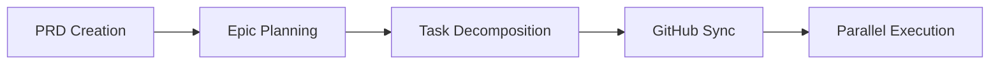

# Project Status: UNDER BUILD

⚠️ **This project is currently under development** ⚠️

---

## Current Status

**Project Name:** Claude Advanced PM
**Original:** Claude Code PM (CCPM) by Automaze.io
**Status:** 🚧 **UNDER BUILD** 🚧
**Last Updated:** 2025-11-18

---

## Development Phase

This is an **active development branch** of the Claude Code PM system with advanced enhancements.

### What's Happening

- 🔨 Enhanced project management features
- 🧪 Advanced workflow optimizations
- 📝 Documentation being updated
- ⚡ Additional features in development

### Known State

- Base: Claude Code PM - Spec-driven development workflow
- Focus: PRD → Epic → Tasks → GitHub Issues → Production
- Technology: Claude Code, GitHub CLI, Git Worktrees, Multiple AI Agents

---

## For Developers

**Status:** Not production-ready
**Testing:** Experimental phase
**Stability:** Under active development

### Use With Caution

This codebase is:
- ❌ Not stable
- ❌ Not production-ready
- ❌ Subject to breaking changes
- ✅ Open for experimentation
- ✅ Available for testing

---

## About Claude Advanced PM

**Claude Advanced PM** is an enhanced version of Claude Code PM - a battle-tested system for spec-driven development.

### Core Philosophy

> **Every line of code must trace back to a specification. No vibe coding.**

### The 5-Phase Discipline

1. **🧠 Brainstorm** - Think deeper than comfortable
2. **📝 Document** - Write specs with zero interpretation needed
3. **📐 Plan** - Architect with explicit technical decisions
4. **⚡ Execute** - Build exactly what was specified
5. **📊 Track** - Maintain transparent progress at every step

---

## Key Features

### 🧠 Context Preservation
- Never lose project state between sessions
- Each epic maintains its own context
- Agents read from `.claude/context/`
- Updates happen locally before syncing

### ⚡ Parallel Execution
- Multiple AI agents working simultaneously
- Tasks marked `parallel: true` enable conflict-free development
- Ship 3-5x faster with parallel task execution

### 🔗 GitHub Native Integration
- GitHub Issues as the database
- Complete traceability: PRD → Epic → Task → Issue → Code
- No separate project management tools needed
- Works with existing GitHub workflows

### 🤖 Agent Specialization
- Different agents for UI, API, database work
- Each agent reads requirements automatically
- Specialized agents preserve context efficiently

### 📊 Full Traceability
- Every decision documented
- Complete audit trail from idea to production
- Transparent progress tracking
- Intelligent prioritization with `/pm:next`

---

## System Architecture

```
.claude/
├── CLAUDE.md          # Always-on instructions
├── agents/            # Task-oriented specialized agents
├── commands/          # Command definitions
│   ├── context/       # Context management
│   ├── pm/            # Project management commands
│   └── testing/       # Test execution
├── context/           # Project-wide context files
├── epics/             # Epic workspace (local)
│   └── [epic-name]/
│       ├── epic.md    # Implementation plan
│       ├── [#].md     # Individual tasks
│       └── updates/   # WIP updates
├── prds/              # Product Requirements Docs
├── rules/             # Custom rules
└── scripts/           # Utility scripts
```

---

## Workflow Overview



### Quick Example

```bash
# Create PRD through guided brainstorming
/pm:prd-new memory-system

# Transform PRD into technical epic
/pm:prd-parse memory-system

# Push to GitHub and start parallel execution
/pm:epic-oneshot memory-system
/pm:issue-start 1235
```

---

## Roadmap

### Phase 1: Foundation (Current)
- [x] Repository renamed to claude-advanced-pm
- [x] Core PM system preserved
- [ ] Enhanced workflow features
- [ ] Advanced agent capabilities
- [ ] Improved documentation

### Phase 2: Enhancement (Planned)
- [ ] Advanced parallel execution strategies
- [ ] Enhanced context management
- [ ] Improved GitHub integration
- [ ] Additional agent specializations
- [ ] Workflow automation improvements

### Phase 3: Stabilization (Future)
- [ ] Comprehensive testing
- [ ] Documentation completion
- [ ] Performance optimization
- [ ] Production readiness
- [ ] Community feedback integration

---

## Proven Results

Teams using the original Claude Code PM system report:
- **89% less time** lost to context switching
- **5-8 parallel tasks** vs 1 previously
- **75% reduction** in bug rates
- **Up to 3x faster** feature delivery

---

## Original Project

**Claude Code PM (CCPM)** is maintained by Automaze.io:
- **GitHub**: https://github.com/automazeio/ccpm
- **Author**: [@aroussi](https://x.com/aroussi)
- **Organization**: [Automaze.io](https://automaze.io)
- **License**: MIT

**Claude Advanced PM** is a development branch with enhancements.

---

## Contact & Contribution

**Note:** This is an experimental enhancement branch. Contributions welcome but expect frequent changes.

**Original Project:** [Claude Code PM on GitHub](https://github.com/automazeio/ccpm)
**Status Updates:** Check this file for latest development status

---

**🚧 BUILD IN PROGRESS 🚧**

*This project is under active development. Check back for updates.*
