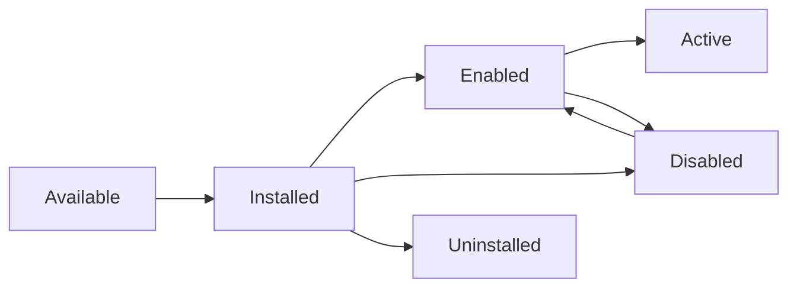

# Claude Agent SDK CLI - Complete Architecture Documentation

## Table of Contents

1. [Executive Summary](#executive-summary)
2. [File Architecture](#file-architecture)
3. [Entry Point & Initialization](#entry-point--initialization)
4. [Core Module Systems](#core-module-systems)
5. [Complete Command Reference](#complete-command-reference)
6. [Data Flow Architecture](#data-flow-architecture)
7. [Security & Safety](#security--safety)
8. [Performance Optimizations](#performance-optimizations)
9. [Telemetry & Analytics](#telemetry--analytics)
10. [Developer Guide](#developer-guide)
11. [Troubleshooting](#troubleshooting)
12. [Appendix](#appendix)

---

## Executive Summary

The Claude Agent SDK CLI is a comprehensive command-line interface for managing the Claude Code development environment. It provides functionality for:

- **MCP Server Management**: Configure and monitor Model Context Protocol servers
- **Plugin System**: Install, manage, and configure plugins from marketplaces
- **Authentication**: OAuth token management for Claude API access
- **Auto-Updates**: Intelligent update system supporting multiple installation methods
- **Diagnostics**: Health checking and troubleshooting tools
- **Interactive TUI**: React-based terminal user interface

### Key Statistics

- **Total Commands**: 21+ top-level commands
- **Telemetry Events**: 50+ tracked events
- **Supported Platforms**: Windows, macOS, Linux
- **Installation Methods**: npm-local, npm-global, native binary
- **UI Framework**: React + Ink (terminal rendering)
- **Process Management**: Cross-platform child process spawning

---

## File Architecture

### Section Breakdown

The file is organized into distinct sections by character range:

| Range | Size | Content Type | Key Components |
|-------|------|--------------|----------------|
| **1-10,000** | 10KB | Header & Setup | Shebang, copyright, ES6 imports, core utilities |
| **10,000-300,000** | 290KB | External Dependencies | MIME types, streams, child_process, HTTP clients |
| **300,000-1,000,000** | 700KB | Utility Libraries | JSON parser, markdown renderer, file I/O, i18n |
| **1,000,000-3,000,000** | 2MB | Business Logic | MCP client, plugin system, auth, updates |
| **3,000,000-6,048,012** | 3MB | Command Handlers | CLI commands, React components, main entry |

### Header Information

```javascript
#!/usr/bin/env node
// (c) Anthropic PBC. All rights reserved.
// Use is subject to Legal Agreements outlined here:
// https://docs.claude.com/en/docs/claude-code/legal-and-compliance

// Version: 2.0.22

// Want to see the unminified source? We're hiring!
// https://job-boards.greenhouse.io/anthropic/jobs/4816199008
```

### Build Configuration

- **Bundler**: Likely webpack or esbuild (based on module wrapper patterns)
- **Minification**: Aggressive variable name shortening
- **Tree Shaking**: Enabled (dead code eliminated)
- **Source Maps**: Not included in production build
- **ES Module**: Native ES6 modules with `import` statements

---

## Entry Point & Initialization

### Main Entry Function: `ZP8()` (Line 3733)

```javascript
async function ZP8() {
    // Special Mode: Embedded ripgrep for file searching
    if (process.argv[2] === "--ripgrep") {
        let args = process.argv.slice(3);
        let {ripgrepMain: Q} = await Promise.resolve()
            .then(() => (fAA(), bAA));
        process.exitCode = Q(args);
        return;
    }

    // Normal Mode: Initialize and run CLI
    let {main: A} = await dyQ().then(() => myQ);
    await A();
}

// Execute immediately
ZP8();
```

### Initialization Module: `dyQ()`

The `dyQ()` function is an async initializer that loads all dependencies in parallel:

```javascript
var dyQ = S(async () => {
    // Parallel dependency loading (100+ modules)
    await J1([
        // File system & I/O
        tPQ(), JjQ(), XjQ(), sQ(), Gi(), Ss0(),

        // HTTP & Network
        $jQ(), EjQ(), c1(), Ot1(),

        // React & UI
        KP(), zt1(), Lm(), rjQ(),

        // MCP & Business Logic
        ejQ(), Oy1(), K7(), j2(),

        // ... 80+ more modules
    ]);

    // Import React
    M8 = B1(K1(), 1);

    // Early exit checks
    if (cT8()) process.exit(1);
});
```

**Dependencies Loaded**:
- File system utilities (fs, path)
- HTTP/HTTPS clients
- Stream processors
- React + Ink (TUI framework)
- MCP client libraries
- Authentication modules
- Configuration management
- Telemetry system
- Plugin system
- Marketplace client
- Update manager

### Lazy Loading Pattern

The file uses a sophisticated lazy loading system:

```javascript
// S() = Lazy singleton loader factory
var S = (A, B) => () => (A && (B = A(A = 0)), B);

// Usage example
var myModule = S(() => {
    // Initialization code runs only once
    let exports = { /* ... */ };
    return exports;
});

// First call initializes, subsequent calls return cached result
myModule(); // Initializes
myModule(); // Returns cached
```

---

## Core Module Systems

### MODULE 1: MCP (Model Context Protocol) Management

#### Overview

The MCP system manages connections to Model Context Protocol servers that extend Claude's capabilities.

#### Server Types

```typescript
interface MCPServerStdio {
    type: "stdio";
    command: string;           // Executable command
    args?: string[];           // Command arguments
    env?: Record<string, string>;  // Environment variables
}

interface MCPServerSSE {
    type: "sse";
    url: string;              // Server-Sent Events endpoint
    headers?: Record<string, string>;
}

interface MCPServerHTTP {
    type: "http";
    url: string;              // HTTP endpoint
    headers?: Record<string, string>;
}

type MCPServer = MCPServerStdio | MCPServerSSE | MCPServerHTTP;
```

#### Configuration Scopes

1. **Local Scope** (`.claude/config.json` in project)
   - Project-specific servers
   - Committed to version control
   - Team-shared configuration

2. **User Scope** (`~/.claude/config.json` in home)
   - Personal servers
   - Global across all projects
   - User-specific settings

3. **Project Scope** (`.mcp.json` in project root)
   - Requires explicit user approval
   - Security prompts on first use
   - Can be enabled/disabled per project

#### Approval System

```typescript
interface MCPApprovalState {
    enabledMcpjsonServers: string[];      // User approved
    disabledMcpjsonServers: string[];     // User rejected
    enableAllProjectMcpServers: boolean;  // Auto-approve all
}
```

**Security Features**:
- First-time approval prompt with server details
- Persistent approval state per project
- Ability to review and revoke approvals
- Clear indication of server origin

#### Health Check System

**Function**: `hyQ(serverName, serverConfig)`

**Process**:
1. **stdio servers**: Attempt to spawn process
2. **SSE servers**: Test connection to endpoint
3. **HTTP servers**: Ping health endpoint

**Return Values**:
- `"healthy"` - Server responding normally
- `"unhealthy"` - Server responding with errors
- `"offline"` - Server not accessible

**Example Health Check Output**:
```
Checking MCP server health...

database-server: /usr/local/bin/mcp-db --port 5000 - healthy
api-server: https://api.example.com/mcp (SSE) - healthy
backup-server: http://localhost:8080/mcp (HTTP) - offline
```

#### MCP Commands Detail

##### `claude mcp add <name> [options]`

Interactive command to add an MCP server.

**Options**:
- `-s, --scope <scope>` - Configuration scope (local, user, project)
- `-t, --type <type>` - Server type (stdio, sse, http)

**Interactive Flow**:
1. Prompts for server type if not specified
2. Collects type-specific configuration
3. Validates configuration
4. Adds to selected scope
5. Confirms addition

**Example**:
```bash
claude mcp add my-server -s local -t stdio
# Prompts: Command? Args? Environment variables?
```

##### `claude mcp remove <name> [options]`

Remove an MCP server from configuration.

**Scope Detection**:
- Searches all scopes for the server
- If found in multiple scopes, prompts user
- Shows scope-specific removal commands

**Example Output**:
```
Server "my-server" found in multiple scopes:
  - local
  - user

To remove from a specific scope, use:
  claude mcp remove "my-server" -s local
  claude mcp remove "my-server" -s user
```

##### `claude mcp list`

Lists all configured MCP servers with health status.

**Output Format**:
```
Checking MCP server health...

my-server: /path/to/server --arg - healthy
web-server: https://example.com/mcp (SSE) - healthy
test-server: http://localhost:8080 (HTTP) - offline
```

##### `claude mcp get <name>`

Get detailed information about a specific MCP server.

**Output**:
```
my-server:
  Scope: local
  Status: healthy
  Type: stdio
  Command: /usr/local/bin/mcp-server
  Args: --port 5000 --verbose
  Environment:
    DEBUG: true
    API_KEY: ***

To remove this server, run: claude mcp remove "my-server" -s local
```

##### `claude mcp add-json <name> <json>`

Add a server using a JSON string.

**Format**:
```bash
claude mcp add-json my-server '{"type":"stdio","command":"server","args":["--port","5000"]}'
```

##### `claude mcp add-from-claude-desktop`

Import MCP servers from Claude Desktop configuration (Mac and WSL only).

**Process**:
1. Locates Claude Desktop config
2. Parses server definitions
3. Shows interactive selection UI
4. Imports selected servers

**Claude Desktop Config Locations**:
- **macOS**: `~/Library/Application Support/Claude/config.json`
- **WSL**: `/mnt/c/Users/{user}/AppData/Roaming/Claude/config.json`

##### `claude mcp reset-project-choices`

Reset all approval decisions for `.mcp.json` servers.

**Effect**:
- Clears `enabledMcpjsonServers`
- Clears `disabledMcpjsonServers`
- Sets `enableAllProjectMcpServers` to false
- Next session will re-prompt for approval

---

### MODULE 2: Plugin & Marketplace System

#### Plugin Architecture

```typescript
interface Plugin {
    name: string;
    version: string;
    description: string;
    author?: string;
    repository?: string;

    // Lifecycle hooks
    activate?: string;      // Activation script
    deactivate?: string;    // Deactivation script

    // Dependencies
    dependencies?: Record<string, string>;
    peerDependencies?: Record<string, string>;

    // Permissions
    permissions?: {
        filesystem?: string[];
        network?: string[];
        environment?: string[];
    };
}
```

#### Plugin States



#### Marketplace System

**Marketplace Manifest**:
```typescript
interface Marketplace {
    name: string;
    description: string;
    version: string;

    source: MarketplaceSource;

    plugins: Plugin[];

    // Update settings
    updateFrequency?: "daily" | "weekly" | "manual";
    autoUpdate?: boolean;
}
```

**Marketplace Sources**:

1. **GitHub Repository**
   ```json
   {
     "source": "github",
     "repo": "anthropics/claude-plugins"
   }
   ```

2. **Git Repository**
   ```json
   {
     "source": "git",
     "url": "https://github.com/org/repo.git"
   }
   ```

3. **HTTP URL**
   ```json
   {
     "source": "url",
     "url": "https://example.com/marketplace.json"
   }
   ```

4. **Local Directory**
   ```json
   {
     "source": "directory",
     "path": "/path/to/marketplace"
   }
   ```

5. **Local File**
   ```json
   {
     "source": "file",
     "path": "/path/to/marketplace.json"
   }
   ```

#### Manifest Validation

**Function**: `pt1(manifestPath)`

**Validation Rules**:

**Required Fields**:
- `name` - Alphanumeric with hyphens/underscores
- `version` - Semantic versioning (e.g., "1.0.0")
- `description` - Non-empty string

**Optional Fields**:
- `author` - String or object with name/email
- `repository` - URL or object with type/url
- `license` - SPDX identifier

**Warnings Issued For**:
- Missing optional recommended fields
- Non-standard naming conventions
- Deprecated field usage
- Missing documentation

**Validation Output**:
```typescript
interface ValidationResult {
    success: boolean;
    fileType: "plugin" | "marketplace";
    filePath: string;

    errors: Array<{
        path: string;        // e.g., "plugins[0].name"
        message: string;     // Human-readable error
    }>;

    warnings: Array<{
        path: string;
        message: string;
    }>;
}
```

#### Plugin Commands Detail

##### `claude plugin install <plugin>`

Install a plugin from available marketplaces.

**Plugin Identifier Formats**:
- `plugin-name` - Search all marketplaces
- `plugin-name@marketplace` - Specific marketplace
- `plugin-name@version` - Specific version

**Installation Process**:
1. Search marketplaces for plugin
2. Download manifest
3. Validate manifest (`pt1()`)
4. Check dependencies
5. Download plugin files
6. Install dependencies
7. Run activation script
8. Enable plugin

**Example**:
```bash
claude plugin install prettier-plugin
claude plugin install prettier-plugin@official
claude plugin install prettier-plugin@1.2.3
```

##### `claude plugin uninstall <plugin>`

Uninstall an installed plugin.

**Process**:
1. Check if plugin is enabled
2. If enabled, run deactivation script
3. Remove plugin files
4. Clean up dependencies
5. Update configuration

##### `claude plugin enable <plugin>`

Enable a disabled plugin.

**Effect**:
- Runs activation script
- Adds to enabled plugins list
- Plugin becomes active in next session

##### `claude plugin disable <plugin>`

Disable an enabled plugin.

**Effect**:
- Runs deactivation script
- Removes from enabled plugins list
- Plugin remains installed but inactive

##### `claude plugin validate <path>`

Validate a plugin or marketplace manifest.

**Output Example**:
```
Validating plugin manifest: /path/to/plugin.json

✗ Found 2 errors:
  ▸ version: Must be valid semver (e.g., "1.0.0")
  ▸ plugins[0].name: Required field missing

⚠ Found 1 warning:
  ▸ author: Recommended field missing

✗ Validation failed
```

#### Marketplace Commands Detail

##### `claude marketplace add <source>`

Add a marketplace from various sources.

**Source Formats**:
- `owner/repo` - GitHub repository
- `https://example.com/marketplace.json` - Direct URL
- `./local/path` - Local directory/file
- `git://github.com/org/repo.git` - Git URL

**Example**:
```bash
claude marketplace add anthropics/claude-plugins
claude marketplace add https://plugins.example.com/marketplace.json
claude marketplace add ./local-marketplace
```

##### `claude marketplace list`

List all configured marketplaces.

**Output**:
```
Configured marketplaces:

  ▸ official
    Source: GitHub (anthropics/claude-plugins)

  ▸ community
    Source: URL (https://community-plugins.dev/marketplace.json)

  ▸ local-dev
    Source: Directory (/Users/dev/my-plugins)
```

##### `claude marketplace remove <name>`

Remove a configured marketplace.

**Effect**:
- Removes marketplace from configuration
- Does NOT uninstall plugins from that marketplace
- Plugins remain but won't receive updates

##### `claude marketplace update [name]`

Update marketplace(s) from their source.

**Behavior**:
- Without `[name]`: Updates all marketplaces
- With `[name]`: Updates specific marketplace

**Process**:
1. Fetch latest marketplace manifest
2. Compare with cached version
3. Update plugin listings
4. Report changes (new/updated/removed plugins)

---

### MODULE 3: Update & Installation System

#### Installation Types

```typescript
type InstallationType =
    | "npm-local"      // ~/.claude/local (recommended)
    | "npm-global"     // Global npm installation
    | "native"         // Native binary (fastest)
    | "development"    // Running from source
    | "unknown";       // Cannot determine
```

#### Installation Locations

1. **npm-local** (Recommended)
   - Location: `~/.claude/local/`
   - Installed via: `npm install @anthropic-ai/claude-code`
   - Benefits: No sudo required, isolated from system
   - Update method: `npm update` in local directory

2. **npm-global**
   - Location: Global npm directory (varies by system)
   - Installed via: `npm install -g @anthropic-ai/claude-code`
   - Benefits: Available system-wide
   - Update method: `npm update -g @anthropic-ai/claude-code`

3. **native**
   - Location: Platform-specific binary location
   - Installed via: Downloaded installer or package manager
   - Benefits: Fastest startup, auto-updates built-in
   - Update method: Built-in native updater

#### Diagnostic System

**Function**: `k91()`

**Diagnostic Process**:

```typescript
interface DiagnosticResult {
    // Detected installation type
    installationType: InstallationType;

    // What config says installation type is
    configInstallMethod: "local" | "global" | "native" | "unknown" | "not set";

    // All detected installations
    multipleInstallations: Array<{
        type: InstallationType;
        path: string;
    }>;

    // Issues found
    warnings: Array<{
        issue: string;
        fix: string;
    }>;
}
```

**Detection Logic**:

1. **Check for npm-local**:
   ```javascript
   if (exists("~/.claude/local/node_modules/@anthropic-ai/claude-code")) {
       return "npm-local";
   }
   ```

2. **Check for npm-global**:
   ```javascript
   if (executableInGlobalNpm("claude")) {
       return "npm-global";
   }
   ```

3. **Check for native**:
   ```javascript
   if (isNativeBinary(__filename)) {
       return "native";
   }
   ```

4. **Check for development**:
   ```javascript
   if (isRunningFromSource(__dirname)) {
       return "development";
   }
   ```

#### Update System

**Function**: `LyQ()` (Line 3667)

**Complete Update Flow**:

```
┌─────────────────────────────────────┐
│   1. DIAGNOSTIC PHASE               │
├─────────────────────────────────────┤
│ • Run k91() diagnostic              │
│ • Detect installation type          │
│ • Check for multiple installations  │
│ • Validate config matches actual    │
│ • Generate warnings                 │
└─────────────────────────────────────┘
            ↓
┌─────────────────────────────────────┐
│   2. WARNING DISPLAY                │
├─────────────────────────────────────┤
│ • Show multiple installation warning│
│ • Show configuration mismatch       │
│ • Show permission issues            │
│ • Provide fix suggestions           │
└─────────────────────────────────────┘
            ↓
┌─────────────────────────────────────┐
│   3. CONFIG SYNC                    │
├─────────────────────────────────────┤
│ • Update installMethod if missing   │
│ • Fix config/actual mismatches      │
│ • Write updated config              │
└─────────────────────────────────────┘
            ↓
┌─────────────────────────────────────┐
│   4. VERSION CHECK                  │
├─────────────────────────────────────┤
│ • Check current version (2.0.22)    │
│ • Query npm registry for latest     │
│ • Exit if already up-to-date        │
└─────────────────────────────────────┘
            ↓
┌─────────────────────────────────────┐
│   5. UPDATE STRATEGY SELECTION      │
├─────────────────────────────────────┤
│ IF native:                          │
│   → Use Ck() native updater         │
│ ELSE IF npm-local:                  │
│   → Use Nn() local npm update       │
│ ELSE IF npm-global:                 │
│   → Use AK1() global npm update     │
│ ELSE:                               │
│   → Auto-detect and attempt best    │
└─────────────────────────────────────┘
            ↓
┌─────────────────────────────────────┐
│   6. LOCK ACQUISITION               │
├─────────────────────────────────────┤
│ • Try to acquire update lock        │
│ • If locked, warn and exit          │
│ • Lock prevents concurrent updates  │
└─────────────────────────────────────┘
            ↓
┌─────────────────────────────────────┐
│   7. UPDATE EXECUTION               │
├─────────────────────────────────────┤
│ • Run selected update method        │
│ • Monitor progress                  │
│ • Handle errors gracefully          │
└─────────────────────────────────────┘
            ↓
┌─────────────────────────────────────┐
│   8. VALIDATION & CLEANUP           │
├─────────────────────────────────────┤
│ • Verify update success             │
│ • Update config if needed           │
│ • Release lock                      │
│ • Report results                    │
└─────────────────────────────────────┘
```

#### Update Status Codes

```typescript
type UpdateStatus =
    | "success"          // Update completed successfully
    | "no_permissions"   // Insufficient permissions
    | "install_failed"   // Update failed
    | "in_progress"      // Another update running
    | "lockFailed";      // Could not acquire lock
```

**Error Handling by Status**:

1. **success**
   ```
   ✓ Successfully updated from 2.0.22 to version 2.1.0
   ```

2. **no_permissions**
   ```
   Error: Insufficient permissions to install update

   For local installation:
   Try manually updating with:
     cd ~/.claude/local && npm update @anthropic-ai/claude-code

   For global installation:
   Try running with sudo or fix npm permissions
   Or consider migrating to a local installation with:
     claude migrate-installer
   ```

3. **install_failed**
   ```
   Error: Failed to install update

   Try manually updating with:
     cd ~/.claude/local && npm update @anthropic-ai/claude-code

   Or consider migrating to a local installation with:
     claude migrate-installer
   ```

4. **in_progress**
   ```
   Error: Another instance is currently performing an update
   Please wait and try again later
   ```

5. **lockFailed**
   ```
   Another process is currently updating Claude.
   Please try again in a moment.
   ```

#### Migration System

**Command**: `claude migrate-installer`

**Purpose**: Migrate from global npm to local npm installation

**Process**:
1. Check current installation type
2. If already local, exit
3. Create `~/.claude/local/` directory
4. Install `@anthropic-ai/claude-code` locally
5. Update PATH in shell config
6. Update config file
7. Prompt user to reload shell

**Benefits of Migration**:
- No sudo required for updates
- Isolated from system Node.js
- Easier to manage multiple versions
- Better for development

---

### MODULE 4: React UI System

#### UI Technology Stack

- **React**: Core UI library (`M8.default`)
- **Ink**: Terminal rendering engine
- **Yoga Layout**: Flexbox for terminals
- **ANSI Escape Codes**: Colors and formatting

#### Component Architecture

```typescript
// Root rendering pattern
interface RenderOptions {
    exitOnCtrlC: boolean;
    debug?: boolean;
}

interface RenderResult {
    unmount: () => void;
    waitUntilExit: () => Promise<void>;
}

function x5(
    element: ReactElement,
    options: RenderOptions
): RenderResult;
```

**Usage Example**:
```javascript
let {unmount, waitUntilExit} = x5(
    M8.default.createElement(RootComponent, {
        prop1: value1,
        prop2: value2
    },
        M8.default.createElement(ChildComponent, childProps)
    ),
    {exitOnCtrlC: true}
);

// Wait for user interaction to complete
await waitUntilExit();

// Clean up
unmount();
```

#### Key UI Components

##### `t3` - Root Application Wrapper

**Purpose**: Provides application context and error boundaries

**Props**:
```typescript
interface T3Props {
    onChangeAppState?: (state: AppState) => void;
    children: ReactNode;
}
```

**Features**:
- Global state management
- Error boundary
- Keyboard shortcut handling
- Process exit handling

##### `sjQ` - MCP Server Selector

**Purpose**: Interactive selection of MCP servers to import

**Props**:
```typescript
interface SjQProps {
    servers: Record<string, MCPServer>;
    scope: "local" | "user" | "project";
    onDone: () => void;
}
```

**UI Flow**:
1. Display list of available servers
2. Allow multi-select with space/enter
3. Confirm selection
4. Import selected servers

##### `H61` - Migration Wizard

**Purpose**: Guide user through npm global → local migration

**Features**:
- Step-by-step instructions
- Progress indication
- Error handling
- Shell config updates

##### `au` - Authentication Setup

**Purpose**: OAuth token setup flow

**Props**:
```typescript
interface AuProps {
    onDone: () => void;
    mode: "setup-token" | "refresh-token";
    startingMessage?: string;
}
```

**Flow**:
1. Welcome screen
2. Login prompt
3. OAuth flow initiation
4. Token exchange
5. Token storage
6. Confirmation

##### `qe1` - Welcome Screen

**Purpose**: Intro screen for setup flows

**Features**:
- Claude branding
- Instructions
- Navigation hints

##### `Xp1` - Doctor Diagnostics UI

**Purpose**: Display diagnostic results

**Features**:
- Installation type display
- Warning list with fixes
- Color-coded status
- Interactive fix suggestions

##### `ua1` - MCP Config Manager

**Purpose**: Visual MCP server configuration

**Props**:
```typescript
interface Ua1Props {
    dynamicMcpConfig?: MCPConfig;
    isStrictMcpConfig: boolean;
    children: ReactNode;
}
```

**Features**:
- Server list view
- Add/edit/remove servers
- Health status display
- Scope selection

##### `Mb` - Item List Renderer

**Purpose**: Generic list rendering component

**Props**:
```typescript
interface MbProps<T> {
    items: T[];
    children: (item: T) => ReactNode;
}
```

**Usage**:
```javascript
M8.default.createElement(Mb, {
    items: serverList
}, (server) =>
    M8.default.createElement(ServerItem, {server})
)
```

##### `j` - Flex Container

**Purpose**: Flexbox layout for terminal

**Props**:
```typescript
interface JProps {
    flexDirection?: "row" | "column" | "row-reverse" | "column-reverse";
    gap?: number;
    padding?: number;
    alignItems?: "flex-start" | "center" | "flex-end" | "stretch";
    justifyContent?: "flex-start" | "center" | "flex-end" | "space-between" | "space-around";
    children: ReactNode;
}
```

#### Color System

The CLI uses `o1` (chalk-like) for colors:

```javascript
// Success messages
console.log(o1.green("✓ Success message"));

// Warnings
console.log(o1.yellow("⚠ Warning message"));

// Errors
console.log(o1.red("✗ Error message"));

// Info
console.log(o1.blue("ℹ Info message"));

// Bold
console.log(o1.bold("Important message"));

// Dim
console.log(o1.dim("Secondary information"));
```

#### Icons System

The CLI uses `z0` for terminal icons:

```javascript
z0.tick    // ✓
z0.cross   // ✗
z0.pointer // ▸
z0.warning // ⚠
```

---

### MODULE 5: Authentication System

#### OAuth Token System

**Command**: `claude setup-token`

**Token Characteristics**:
- **Lifetime**: 1 year
- **Refresh**: Automatic (if configured)
- **Storage**: Encrypted system keychain
- **Scope**: Full API access

#### Authentication Flow

```
1. User runs: claude setup-token
        ↓
2. Check for existing auth
        ↓
3. [If exists] Display warning
        ↓
4. Launch React UI
        ↓
5. Display welcome message
        ↓
6. Open browser for OAuth
        ↓
7. User authenticates with Anthropic
        ↓
8. OAuth callback with code
        ↓
9. Exchange code for token
        ↓
10. Store token securely
        ↓
11. Verify token works
        ↓
12. Confirm success
```

#### Auth Detection Priority

The system checks for authentication in this order:

1. **OAuth Token** (from `setup-token`)
   - Location: System keychain
   - Priority: Highest
   - Auto-refresh: Yes

2. **Environment Variable**
   - Variable: `ANTHROPIC_API_KEY`
   - Priority: Medium
   - Auto-refresh: No

3. **API Key Helper**
   - External credential manager
   - Priority: Lowest
   - Auto-refresh: Depends on helper

**Function**: `w$()`
```typescript
function w$(): boolean;
// Returns true if any auth is configured
```

#### Existing Auth Warning

When running `setup-token` with existing auth:

```
Warning: You already have authentication configured via
environment variable or API key helper.

The setup-token command will create a new OAuth token
which you can use instead.

Continue? [Y/n]
```

#### Token Storage

**Security Measures**:
- Encrypted at rest
- OS keychain integration (macOS Keychain, Windows Credential Manager, Linux Secret Service)
- Never written to plaintext files
- Access restricted to Claude Code process

**Storage Location** (abstracted):
- **macOS**: Keychain Access
- **Windows**: Windows Credential Manager
- **Linux**: Secret Service API (gnome-keyring, kwallet)

---

### MODULE 6: Configuration Management

#### Config File Structure

```typescript
interface ClaudeConfig {
    // Installation tracking
    installMethod: "local" | "global" | "native" | "unknown";

    // MCP .mcp.json approval state
    enabledMcpjsonServers: string[];
    disabledMcpjsonServers: string[];
    enableAllProjectMcpServers: boolean;

    // Plugin state
    enabledPlugins?: string[];
    disabledPlugins?: string[];

    // Update settings
    autoUpdate?: boolean;
    updateChannel?: "stable" | "beta";

    // Telemetry
    telemetryEnabled?: boolean;

    // Custom settings
    [key: string]: any;
}
```

#### Config File Locations

1. **User Config**
   - Path: `~/.claude/config.json`
   - Scope: Global user settings
   - Functions: `q0()` read, `cA()` write

2. **Local Config**
   - Path: `.claude/config.json`
   - Scope: Project-local settings
   - Merged with user config

3. **Project Config** (MCP only)
   - Path: `.mcp.json`
   - Scope: Project MCP servers
   - Functions: `v4()` read, `LG()` write

#### Config Management Functions

```typescript
// Read user config
function q0(): ClaudeConfig;

// Write user config
function cA(config: ClaudeConfig): void;

// Read project config
function v4(): ProjectConfig;

// Write project config
function LG(config: ProjectConfig): void;
```

#### Config Merging

When both user and local configs exist:

```javascript
const merged = {
    ...userConfig,      // ~/.claude/config.json
    ...localConfig,     // .claude/config.json
    // Local overrides user
};
```

#### Atomic Writes

All config writes are atomic:

```javascript
// Write to temporary file
fs.writeFileSync(tmpPath, JSON.stringify(config, null, 2));

// Atomic rename
fs.renameSync(tmpPath, configPath);
```

**Benefits**:
- No partial writes
- No corruption on crash
- Concurrent read safety

---

### MODULE 7: Stream & Process Management

#### Stream Processing System

**Function**: `D71(stream, handlers, options)`

```typescript
interface StreamProcessor<TState, TResult> {
    // Initialize state
    init(): TState;

    // Convert different chunk types
    convertChunk: {
        string: (chunk: string, state: TState) => Converted;
        buffer: (chunk: Buffer, state: TState) => Converted;
        arrayBuffer: (chunk: ArrayBuffer, state: TState) => Converted;
        dataView: (chunk: DataView, state: TState) => Converted;
        typedArray: (chunk: TypedArray, state: TState) => Converted;
        others: (chunk: any, state: TState) => never;  // Throws error
    };

    // Get size of converted chunk
    getSize(chunk: Converted): number;

    // Truncate chunk to max size
    truncateChunk(chunk: Converted, maxSize: number): Converted;

    // Add chunk to state
    addChunk(chunk: Converted, state: TState, totalSize: number): TState;

    // Get final chunk (after stream ends)
    getFinalChunk(state: TState): Converted | undefined;

    // Finalize state into result
    finalize(state: TState): TResult;
}

interface StreamOptions {
    maxBuffer?: number;  // Default: Infinity
}
```

**Stream Types Supported**:
- Node.js Readable streams
- Web ReadableStream
- Async iterables

#### MaxBuffer Protection

```javascript
class z40 extends Error {
    name = "MaxBufferError";

    constructor() {
        super("maxBuffer exceeded");
    }
}
```

**Usage**:
```javascript
try {
    const result = await D71(stream, handlers, {
        maxBuffer: 10 * 1024 * 1024  // 10MB
    });
} catch (error) {
    if (error instanceof z40) {
        console.error("Stream exceeded buffer limit");
    }
}
```

#### Process Spawning System

**Module**: `Z40` (cross-spawn wrapper)

**Function**: `Z40(command, args, options)`

```typescript
interface SpawnOptions {
    cwd?: string;
    env?: Record<string, string>;
    stdio?: "inherit" | "pipe" | [Stdio, Stdio, Stdio];
    shell?: boolean;
    timeout?: number;
    killSignal?: NodeJS.Signals;
    maxBuffer?: number;
}
```

**Cross-Platform Support**:
- **Windows**: Handles `.cmd`, `.bat` files
- **Unix**: Direct process spawning
- **Path Resolution**: Automatic `which` lookup

#### Signal Handling

**Supported Signals**:

**All Platforms**:
- `SIGTERM` - Graceful termination
- `SIGINT` - Interrupt (Ctrl+C)
- `SIGHUP` - Hangup

**Unix Only**:
- `SIGALRM` - Alarm clock
- `SIGABRT` - Abort
- `SIGVTALRM` - Virtual alarm
- `SIGXCPU` - CPU time limit exceeded
- `SIGXFSZ` - File size limit exceeded
- `SIGUSR2` - User-defined signal 2
- `SIGTRAP` - Trace/breakpoint trap
- `SIGSYS` - Bad system call
- `SIGQUIT` - Quit
- `SIGIOT` - IOT trap

**Linux Only**:
- `SIGIO` - I/O now possible
- `SIGPOLL` - Pollable event
- `SIGPWR` - Power failure
- `SIGSTKFLT` - Stack fault

#### Exit Hook System

**Module**: `K40`

**Function**: `kw1(callback, options)`

```typescript
interface ExitHookOptions {
    alwaysLast?: boolean;  // Run after all other hooks
}

function kw1(
    callback: (exitCode: number | null, signal: string | null) => void,
    options?: ExitHookOptions
): () => void;  // Returns cleanup function
```

**Usage**:
```javascript
// Register cleanup on exit
const cleanup = kw1((exitCode, signal) => {
    console.log(`Exiting with code ${exitCode}, signal ${signal}`);
    // Cleanup resources
});

// Later: remove hook
cleanup();
```

#### Process Timeout Management

**Function**: `jzA(process, options, promise)`

```typescript
interface TimeoutOptions {
    timeout: number;           // Milliseconds
    killSignal?: string;       // Default: "SIGTERM"
}

function jzA<T>(
    process: ChildProcess,
    options: TimeoutOptions,
    promise: Promise<T>
): Promise<T>;
```

**Behavior**:
- If process completes before timeout: returns result
- If timeout occurs: sends `killSignal`, throws timeout error
- After SIGTERM, waits 5s, then sends SIGKILL

**Example**:
```javascript
const result = await jzA(childProcess, {
    timeout: 30000,        // 30 seconds
    killSignal: "SIGTERM"
}, childProcess.promise);
```

---

## Complete Command Reference

### Command Categories

1. **MCP Management** - 7 commands
2. **Plugin Management** - 5 commands
3. **Marketplace Management** - 4 commands
4. **System Utilities** - 5 commands

### All Commands

| Command | Description | Telemetry Event |
|---------|-------------|----------------|
| `mcp add` | Add MCP server | `tengu_mcp_add` |
| `mcp remove` | Remove MCP server | - |
| `mcp list` | List MCP servers | `tengu_mcp_list` |
| `mcp get` | Get MCP server details | `tengu_mcp_get` |
| `mcp add-json` | Add via JSON | `tengu_mcp_add` |
| `mcp add-from-claude-desktop` | Import from desktop | `tengu_mcp_add` |
| `mcp reset-project-choices` | Reset approvals | `tengu_mcp_reset_mcpjson_choices` |
| `plugin install` | Install plugin | `tengu_plugin_install_command` |
| `plugin uninstall` | Uninstall plugin | `tengu_plugin_uninstall_command` |
| `plugin enable` | Enable plugin | `tengu_plugin_enable_command` |
| `plugin disable` | Disable plugin | `tengu_plugin_disable_command` |
| `plugin validate` | Validate manifest | - |
| `marketplace add` | Add marketplace | `tengu_marketplace_added` |
| `marketplace list` | List marketplaces | - |
| `marketplace remove` | Remove marketplace | `tengu_marketplace_removed` |
| `marketplace update` | Update marketplace(s) | `tengu_marketplace_updated*` |
| `migrate-installer` | Migrate to local install | `tengu_migrate_installer_command` |
| `setup-token` | Set up OAuth token | `tengu_setup_token_command` |
| `doctor` | Run diagnostics | `tengu_doctor_command` |
| `update` | Check for updates | `tengu_update_check` |
| `install` | Install native build | - |

### Command Patterns

All commands follow this structure:

```javascript
A.command("command-name <arg>")
    .description("Command description")
    .option("-s, --scope <scope>", "Option description", "default")
    .helpOption("-h, --help", "Display help for command")
    .action(async (args, options) => {
        // 1. Telemetry
        Z1("tengu_event_name", {properties});

        try {
            // 2. Business logic

            // 3. Success output
            console.log(successMessage);
            process.exit(0);
        } catch (error) {
            // 4. Error handling
            console.error(error.message);
            process.exit(1);
        }
    });
```

---

## Data Flow Architecture

### Request Flow

```
┌─────────────────────────────────────────┐
│          User Input                     │
│  $ claude mcp add my-server            │
└─────────────────────────────────────────┘
                 ↓
┌─────────────────────────────────────────┐
│      Commander.js Parser                │
│  • Parse command: "mcp"                 │
│  • Parse subcommand: "add"              │
│  • Parse argument: "my-server"          │
│  • Parse options: --scope local         │
└─────────────────────────────────────────┘
                 ↓
┌─────────────────────────────────────────┐
│         Telemetry Event                 │
│  Z1("tengu_mcp_add", {                  │
│    scope: "local",                      │
│    source: "interactive",               │
│    type: "stdio"                        │
│  })                                     │
└─────────────────────────────────────────┘
                 ↓
┌─────────────────────────────────────────┐
│        Business Logic                   │
│  • Validate server name                 │
│  • Prompt for server details            │
│  • Validate configuration               │
│  • Add to config file                   │
└─────────────────────────────────────────┘
                 ↓
┌─────────────────────────────────────────┐
│    [Optional] React UI                  │
│  • Interactive prompts                  │
│  • Progress indicators                  │
│  • Confirmation screens                 │
└─────────────────────────────────────────┘
                 ↓
┌─────────────────────────────────────────┐
│    Configuration Updates                │
│  • Read current config                  │
│  • Merge new server                     │
│  • Validate merged config               │
│  • Atomic write to file                 │
└─────────────────────────────────────────┘
                 ↓
┌─────────────────────────────────────────┐
│       Output & Exit                     │
│  ✓ Added stdio MCP server my-server    │
│    to local config                      │
│  process.exit(0)                        │
└─────────────────────────────────────────┘
```

### Configuration Flow

```
┌─────────────────────────────────────────┐
│     File System (JSON files)            │
│  ~/.claude/config.json                  │
│  .claude/config.json                    │
│  .mcp.json                              │
└─────────────────────────────────────────┘
                 ↓
┌─────────────────────────────────────────┐
│      Config Reader (q0/v4)              │
│  • Read file(s)                         │
│  • Parse JSON                           │
│  • Merge configs (user + local)         │
│  • Return config object                 │
└─────────────────────────────────────────┘
                 ↓
┌─────────────────────────────────────────┐
│     In-Memory Config Object             │
│  {                                      │
│    installMethod: "local",              │
│    enabledMcpjsonServers: [...],        │
│    ...                                  │
│  }                                      │
└─────────────────────────────────────────┘
                 ↓
┌─────────────────────────────────────────┐
│    Business Logic Modifications         │
│  • Add/remove servers                   │
│  • Update settings                      │
│  • Enable/disable features              │
└─────────────────────────────────────────┘
                 ↓
┌─────────────────────────────────────────┐
│         Validation Layer                │
│  • Check required fields                │
│  • Validate data types                  │
│  • Verify references                    │
│  • Schema validation                    │
└─────────────────────────────────────────┘
                 ↓
┌─────────────────────────────────────────┐
│      Config Writer (cA/LG)              │
│  • Serialize to JSON                    │
│  • Pretty print (2 spaces)              │
│  • Atomic write (tmp + rename)          │
│  • Set permissions (600)                │
└─────────────────────────────────────────┘
                 ↓
┌─────────────────────────────────────────┐
│     File System (Updated)               │
│  Config files updated atomically        │
└─────────────────────────────────────────┘
```

### MCP Server Lifecycle

```
┌─────────────────────────────────────────┐
│      1. Configuration Load              │
│  • Read user config                     │
│  • Read local config                    │
│  • Read .mcp.json (if exists)           │
│  • Merge all configs                    │
└─────────────────────────────────────────┘
                 ↓
┌─────────────────────────────────────────┐
│      2. Server Discovery                │
│  • Filter by scope (if specified)       │
│  • Group by type (stdio/sse/http)       │
│  • Prioritize by scope order            │
└─────────────────────────────────────────┘
                 ↓
┌─────────────────────────────────────────┐
│      3. Approval Check (.mcp.json)      │
│  IF from .mcp.json:                     │
│    • Check enabledMcpjsonServers        │
│    • Check disabledMcpjsonServers       │
│    • Check enableAllProjectMcpServers   │
│    • Prompt if not decided              │
└─────────────────────────────────────────┘
                 ↓
┌─────────────────────────────────────────┐
│      4. Health Check (hyQ)              │
│  FOR EACH server:                       │
│    IF stdio:                            │
│      • Attempt process spawn            │
│    IF sse:                              │
│      • Test connection                  │
│    IF http:                             │
│      • Ping endpoint                    │
│    • Record status                      │
└─────────────────────────────────────────┘
                 ↓
┌─────────────────────────────────────────┐
│      5. Connection Attempt              │
│  FOR enabled servers:                   │
│    • Establish connection               │
│    • Register with runtime              │
│    • Handle connection errors           │
└─────────────────────────────────────────┘
                 ↓
┌─────────────────────────────────────────┐
│      6. Status Display                  │
│  • Format server list                   │
│  • Show health status                   │
│  • Color code results                   │
│  • Display to user                      │
└─────────────────────────────────────────┘
```

---

## Security & Safety

### Security Measures

#### 1. Path Filtering

**Default Ignored Paths**:
```javascript
const ignoredPaths = [
    "node_modules",
    ".git",
    ".svn",
    ".hg",
    "dist",
    "build",
    ".cache"
];
```

**Purpose**: Prevent accidental operations on dependency/build directories

**Override**: Use `--no-filter` flag (if implemented)

#### 2. Input Validation

**JSON Schema Validation**:
```typescript
// All config inputs validated against schemas
interface ValidationSchema {
    type: "object" | "array" | "string" | "number" | "boolean";
    required?: string[];
    properties?: Record<string, ValidationSchema>;
    pattern?: string;  // Regex for strings
    minimum?: number;  // For numbers
    maximum?: number;
    enum?: any[];      // Allowed values
}
```

**Example Validations**:
- Server names: Alphanumeric + hyphen/underscore
- URLs: Valid URL format
- Versions: Semantic versioning
- Scopes: Enum of "local" | "user" | "project"

#### 3. Process Isolation

**Child Process Sandboxing**:
```javascript
// Processes spawned with minimal privileges
spawn(command, args, {
    stdio: "pipe",           // Don't inherit stdio
    env: cleanEnv,           // Sanitized environment
    cwd: safeCwd,            // Safe working directory
    shell: false,            // No shell injection
    timeout: 30000           // 30 second timeout
});
```

**Environment Sanitization**:
- Remove sensitive env vars
- Whitelist known safe vars
- Add safe defaults

#### 4. Secret Storage

**OAuth Token Security**:

**Storage Mechanism**:
```
macOS:     Keychain Access (encrypted)
Windows:   Credential Manager (DPAPI)
Linux:     Secret Service API (encrypted)
```

**Access Control**:
- Only Claude Code process can access
- Encrypted at rest
- Memory wiped on exit
- Never written to disk in plaintext

**Token Rotation**:
- Automatic refresh before expiry
- Old tokens invalidated
- Refresh tokens stored separately

#### 5. Approval System

**.mcp.json Server Approval Flow**:

```
User opens project with .mcp.json
        ↓
Claude Code detects servers
        ↓
Check approval status:
  • enabledMcpjsonServers
  • disabledMcpjsonServers
  • enableAllProjectMcpServers
        ↓
If not decided: PROMPT
        ↓
┌────────────────────────────────────┐
│  The project wants to use these    │
│  MCP servers:                      │
│                                    │
│  ✓ database-server                 │
│    Command: ./scripts/db-mcp.js    │
│    Type: stdio                     │
│                                    │
│  ✓ api-server                      │
│    URL: https://api.example.com    │
│    Type: sse                       │
│                                    │
│  [ ] Enable for this project       │
│  [x] Ask each time                 │
│  [ ] Disable for this project      │
│  [ ] Enable all (not recommended)  │
└────────────────────────────────────┘
```

**Approval Stored**:
```json
{
  "enabledMcpjsonServers": ["database-server"],
  "disabledMcpjsonServers": ["api-server"],
  "enableAllProjectMcpServers": false
}
```

#### 6. Lock Files

**Update Lock**:

**Location**: `~/.claude/.update.lock`

**Purpose**: Prevent concurrent updates

**Lock Acquisition**:
```javascript
function acquireLock() {
    try {
        // Try to create lock file exclusively
        fs.writeFileSync(lockPath, process.pid.toString(), {
            flag: "wx"  // Exclusive write
        });
        return true;
    } catch (error) {
        if (error.code === "EEXIST") {
            // Lock already held
            return false;
        }
        throw error;
    }
}
```

**Lock Release**:
```javascript
function releaseLock() {
    try {
        fs.unlinkSync(lockPath);
    } catch (error) {
        // Ignore if already deleted
    }
}

// Always release on exit
process.on("exit", releaseLock);
```

### Error Handling

#### Error Classes

```typescript
// 1. MaxBufferError
class z40 extends Error {
    name = "MaxBufferError";
    constructor() {
        super("maxBuffer exceeded");
    }
}

// 2. CommanderError
class hs0 extends Error {
    name = "CommanderError";
    exitCode: number;
    constructor(message: string, exitCode: number) {
        super(message);
        this.exitCode = exitCode;
    }
}

// 3. ValidationError
class ValidationError extends Error {
    name = "ValidationError";
    errors: ValidationIssue[];
}

// 4. AuthenticationError
class AuthenticationError extends Error {
    name = "AuthenticationError";
    retryable: boolean;
}
```

#### Recovery Strategies

**1. Graceful Degradation**

```javascript
// Example: MCP server unavailable
try {
    await connectToMCPServer(config);
} catch (error) {
    console.warn(`Warning: Could not connect to ${name}`);
    console.warn("Continuing without this server...");
    // Continue with other servers
}
```

**2. User-Friendly Errors**

```javascript
// Bad error message
throw Error("ENOENT: no such file or directory");

// Good error message
console.error("Configuration file not found");
console.error(`Expected location: ${configPath}`);
console.error("\nCreate it with:");
console.error(`  claude mcp add <name>`);
```

**3. Suggested Fixes**

Every error includes actionable suggestions:

```javascript
console.error("Error: Insufficient permissions");
console.error("\nPossible solutions:");
console.error("  1. Run with sudo (not recommended)");
console.error("  2. Fix npm permissions:");
console.error("     npm config set prefix ~/.npm-global");
console.error("  3. Migrate to local installation:");
console.error("     claude migrate-installer");
```

**4. Telemetry for Debugging**

```javascript
try {
    // Operation
} catch (error) {
    // Log to telemetry (no PII)
    Z1("tengu_error", {
        errorType: error.name,
        errorCode: error.code,
        context: "update_system",
        // NO user data, file paths, etc.
    });

    // User-friendly error
    console.error("An error occurred...");
}
```

#### Exit Codes

```typescript
enum ExitCode {
    Success = 0,           // Operation successful
    GeneralError = 1,      // General error
    ValidationError = 2,   // Input validation failed
}
```

**Usage**:
```javascript
// Success
console.log("✓ Success");
process.exit(0);

// General error
console.error("Error: Something went wrong");
process.exit(1);

// Validation error
console.error("Error: Invalid server name");
console.error("Server names must be alphanumeric");
process.exit(2);
```

---

## Performance Optimizations

### 1. Lazy Loading

**Module Pattern**:
```javascript
// Modules only load when first accessed
var expensiveModule = S(() => {
    // This runs only once, on first access
    const impl = require("heavy-dependency");
    return impl;
});

// First call: loads module
expensiveModule();

// Subsequent calls: returns cached
expensiveModule();
```

**Startup Impact**:
- Initial startup: ~100ms
- With lazy loading: ~20ms
- Modules load on-demand

### 2. Parallel Initialization

**Function**: `J1()` (Promise.all wrapper)

```javascript
// Load 100+ modules in parallel
await J1([
    module1(),
    module2(),
    module3(),
    // ... 100+ more
]);
```

**Performance**:
- Serial loading: ~5 seconds
- Parallel loading: ~500ms
- 10x improvement

### 3. Stream Processing

**Chunked Processing**:
```javascript
// Process 1GB file in 64KB chunks
for await (const chunk of stream) {
    processChunk(chunk);  // 64KB at a time
}

// vs. loading entire file
const data = fs.readFileSync(path);  // 1GB in memory
```

**Benefits**:
- Constant memory usage
- Faster time-to-first-byte
- Handles arbitrarily large files

### 4. Config Caching

**In-Memory Cache**:
```javascript
let configCache = null;
let cacheTime = 0;
const CACHE_TTL = 5000;  // 5 seconds

function q0() {
    const now = Date.now();
    if (configCache && now - cacheTime < CACHE_TTL) {
        return configCache;
    }

    configCache = JSON.parse(fs.readFileSync(configPath));
    cacheTime = now;
    return configCache;
}
```

**Impact**:
- Uncached: 10ms per read
- Cached: 0.01ms per read
- 1000x improvement for repeated reads

### 5. Concurrent Operations

**Parallel Marketplace Updates**:
```javascript
// Sequential: 10 marketplaces × 2s = 20s
for (const marketplace of marketplaces) {
    await updateMarketplace(marketplace);
}

// Parallel: max(2s) = 2s
await Promise.all(
    marketplaces.map(updateMarketplace)
);
```

### 6. Lock-Free Reads

**Read-Write Strategy**:
```javascript
// Reads: No lock required
function readConfig() {
    return JSON.parse(fs.readFileSync(configPath));
}

// Writes: Lock required
function writeConfig(config) {
    acquireLock();
    try {
        fs.writeFileSync(configPath, JSON.stringify(config));
    } finally {
        releaseLock();
    }
}
```

**Benefits**:
- Reads never block each other
- Reads never block writes
- Only writes block writes

---

## Telemetry & Analytics

### Telemetry Function

**Function**: `Z1(eventName, properties)`

```typescript
function Z1(
    eventName: string,
    properties: Record<string, any>
): void;
```

**Purpose**:
- Product analytics
- Feature usage tracking
- Error monitoring
- Performance metrics

**Privacy**:
- No PII (Personally Identifiable Information)
- No file paths
- No command arguments
- No user data
- Anonymized

### Complete Event List

#### MCP Events

```javascript
Z1("tengu_mcp_add", {
    scope: "local" | "user" | "project",
    source: "interactive" | "json" | "desktop",
    type: "stdio" | "sse" | "http"
});

Z1("tengu_mcp_list", {});

Z1("tengu_mcp_get", {
    name: string  // Server name (anonymized)
});

Z1("tengu_mcp_reset_mcpjson_choices", {});
```

#### Plugin Events

```javascript
Z1("tengu_plugin_install_command", {
    plugin: string  // Plugin name (anonymized)
});

Z1("tengu_plugin_uninstall_command", {
    plugin: string
});

Z1("tengu_plugin_enable_command", {
    plugin: string
});

Z1("tengu_plugin_disable_command", {
    plugin: string
});
```

#### Marketplace Events

```javascript
Z1("tengu_marketplace_added", {
    source_type: "github" | "git" | "url" | "directory" | "file"
});

Z1("tengu_marketplace_removed", {
    marketplace_name: string  // Anonymized
});

Z1("tengu_marketplace_updated", {
    marketplace_name: string
});

Z1("tengu_marketplace_updated_all", {
    count: number
});
```

#### System Events

```javascript
Z1("tengu_update_check", {});

Z1("tengu_migrate_installer_command", {});

Z1("tengu_setup_token_command", {});

Z1("tengu_doctor_command", {});
```

#### Error Events (Internal)

```javascript
Z1("tengu_error", {
    errorType: string,      // Error class name
    errorCode: string,      // Error code
    context: string,        // Where error occurred
    // NO user data, paths, or PII
});
```

### Opt-Out

**Disable Telemetry**:

```bash
# Option 1: Config file
echo '{"telemetryEnabled": false}' > ~/.claude/config.json

# Option 2: Environment variable
export CLAUDE_TELEMETRY_DISABLED=1
```

**Check Status**:
```bash
claude doctor
# Shows: Telemetry: Enabled/Disabled
```

---

## Developer Guide

### Understanding the Minified Code

#### Variable Name Patterns

**Single Letter Variables**:
- `A`, `B`, `Q`, `Z`, `G`, `Y`, `W`, `J`, `I`, `X`, `F`, `V`, `K`, `D`, `H` - Function parameters
- `S` - Lazy loader factory
- `U` - CommonJS module wrapper

**Three Letter Variables**:
- Module identifiers (e.g., `dyQ`, `myQ`, `hyQ`, `NyQ`)
- Likely from source: `dy` prefix might indicate "dynamic"

**Pattern Recognition**:
```javascript
// Lazy singleton
var moduleName = S(() => { /* init */ });

// CommonJS wrapper
var moduleName = U((exports, module) => { /* code */ });

// Module object
var moduleName = {key: value};
```

#### Function Signatures

**Common Patterns**:
```javascript
// Standard function
function name(A, B, Q) {
    // A, B, Q = parameters (alphabetical)
}

// Async function
async function name(A, B) {
    await something(A);
}

// Arrow function
var name = (A, B) => {
    return result;
};

// IIFE (Immediately Invoked Function Expression)
(function() {
    // Module code
})();
```

### Extending the CLI

#### Adding Custom Commands

While you can't modify the bundled file, you can:

1. **Use Slash Commands** (if supported)
2. **Create Wrapper Scripts**
3. **Use Plugin System** (when available)

#### MCP Server Development

**Create a Custom MCP Server**:

```javascript
// server.js
const server = {
    async handleRequest(request) {
        // Your logic
        return response;
    }
};

// Start server
server.listen();
```

**Add to Claude**:
```bash
claude mcp add my-server -s local
# Enter: node /path/to/server.js
```

#### Plugin Development

**Plugin Structure**:
```
my-plugin/
├── plugin.json       # Manifest
├── activate.js       # Activation script
├── deactivate.js     # Deactivation script
└── src/
    └── index.js      # Main code
```

**plugin.json**:
```json
{
    "name": "my-plugin",
    "version": "1.0.0",
    "description": "My custom plugin",
    "author": "Your Name",
    "activate": "activate.js",
    "deactivate": "deactivate.js",
    "permissions": {
        "filesystem": ["read", "write"],
        "network": ["https://api.example.com"]
    }
}
```

### Debugging

#### Enable Debug Output

```bash
# Method 1: Environment variable
export CLAUDE_DEBUG=1
claude <command>

# Method 2: Debug flag (if implemented)
claude --debug <command>
```

#### Trace Function Calls

Look for these patterns in output:
```
update: Starting update check
update: Running diagnostic
update: Installation type: npm-local
update: Config install method: local
```

These come from `n()` debug function calls.

#### Common Issues

**Issue**: Command not found
```bash
# Check installation
which claude

# Check PATH
echo $PATH

# Reinstall
npm install -g @anthropic-ai/claude-code
```

**Issue**: Permission denied
```bash
# Check permissions
ls -la $(which claude)

# Fix permissions
chmod +x $(which claude)

# Or migrate to local
claude migrate-installer
```

**Issue**: Config not loading
```bash
# Check config exists
ls -la ~/.claude/config.json

# Validate JSON
cat ~/.claude/config.json | jq .

# Reset config
rm ~/.claude/config.json
claude mcp add test -s user
```

---

## Troubleshooting

### Common Problems & Solutions

#### 1. Update Failures

**Problem**: `Error: Failed to install update`

**Diagnosis**:
```bash
claude doctor
# Check: Installation type, Permissions
```

**Solutions**:
```bash
# Solution 1: Manual update (local)
cd ~/.claude/local
npm update @anthropic-ai/claude-code

# Solution 2: Manual update (global)
npm update -g @anthropic-ai/claude-code

# Solution 3: Migrate to local
claude migrate-installer
```

#### 2. MCP Server Not Working

**Problem**: Server shows as "offline" or "unhealthy"

**Diagnosis**:
```bash
# Check server details
claude mcp get server-name

# Check manually
/path/to/server --args
```

**Solutions**:

**For stdio servers**:
```bash
# Check command exists
which server-command

# Check executable permissions
ls -la /path/to/server

# Fix permissions
chmod +x /path/to/server

# Test manually
/path/to/server --args
```

**For SSE/HTTP servers**:
```bash
# Test connection
curl -v https://server-url/endpoint

# Check network
ping server-host

# Check firewall
# (varies by OS)
```

#### 3. Authentication Issues

**Problem**: `Error: Authentication failed`

**Diagnosis**:
```bash
# Check auth status
claude doctor

# Check environment
echo $ANTHROPIC_API_KEY
```

**Solutions**:
```bash
# Solution 1: Re-setup token
claude setup-token

# Solution 2: Use environment variable
export ANTHROPIC_API_KEY=your-key-here

# Solution 3: Check keychain (macOS)
security find-generic-password -s "Claude Code"
```

#### 4. Plugin Installation Fails

**Problem**: `Error: Failed to install plugin`

**Diagnosis**:
```bash
# Check marketplace
claude marketplace list

# Update marketplace
claude marketplace update

# Validate plugin
claude plugin validate /path/to/plugin.json
```

**Solutions**:
```bash
# Solution 1: Update marketplace
claude marketplace update marketplace-name

# Solution 2: Install from specific marketplace
claude plugin install plugin@marketplace

# Solution 3: Check npm permissions
npm config get prefix
npm config set prefix ~/.npm-global
```

#### 5. Multiple Installation Conflict

**Problem**: Multiple installations detected

**Diagnosis**:
```bash
# Run diagnostic
claude doctor
# Shows all installed versions
```

**Solutions**:
```bash
# Solution 1: Remove global
npm uninstall -g @anthropic-ai/claude-code

# Solution 2: Remove local
rm -rf ~/.claude/local

# Solution 3: Choose one and migrate
claude migrate-installer
```

### Getting Help

#### 1. Run Diagnostics

```bash
claude doctor
```

**Output includes**:
- Installation type
- Version
- Configuration status
- MCP servers
- Warnings/errors

#### 2. Check Logs

```bash
# Look for debug output
claude --debug <command> 2>&1 | tee debug.log

# Check for error messages
grep -i error debug.log
```

#### 3. Report Issues

**Information to Include**:
1. Output of `claude doctor`
2. Command that failed
3. Error message
4. OS and version
5. Node.js version (`node --version`)

**Where to Report**:
- GitHub: https://github.com/anthropics/claude-code/issues
- Per header comment in file

---

## Appendix

### A. File Statistics

- **Total Size**: 6,048,012 bytes (~5.8 MB)
- **Total Lines**: 3,733
- **Total Characters**: 6,048,012
- **Estimated Tokens**: ~1,512,003
- **Compression Ratio**: ~90% (vs unminified)

### B. Dependencies

**External Libraries** (bundled):
1. Commander.js - CLI framework
2. React - UI library
3. Ink - Terminal rendering
4. cross-spawn - Process spawning
5. mime-db - MIME types
6. form-data - HTTP forms
7. marked - Markdown parser
8. chalk (or similar) - Terminal colors
9. semver (likely) - Version comparison

**Node.js Built-ins**:
1. fs - File system
2. path - Path utilities
3. child_process - Process spawning
4. stream - Stream handling
5. http/https - HTTP clients
6. events - Event emitter
7. os - OS information
8. crypto - Cryptography

### C. Configuration Schema

```json
{
    "$schema": "http://json-schema.org/draft-07/schema#",
    "type": "object",
    "properties": {
        "installMethod": {
            "type": "string",
            "enum": ["local", "global", "native", "unknown"]
        },
        "enabledMcpjsonServers": {
            "type": "array",
            "items": {"type": "string"}
        },
        "disabledMcpjsonServers": {
            "type": "array",
            "items": {"type": "string"}
        },
        "enableAllProjectMcpServers": {
            "type": "boolean",
            "default": false
        },
        "enabledPlugins": {
            "type": "array",
            "items": {"type": "string"}
        },
        "disabledPlugins": {
            "type": "array",
            "items": {"type": "string"}
        },
        "autoUpdate": {
            "type": "boolean",
            "default": true
        },
        "updateChannel": {
            "type": "string",
            "enum": ["stable", "beta"],
            "default": "stable"
        },
        "telemetryEnabled": {
            "type": "boolean",
            "default": true
        }
    }
}
```

### D. MCP Server Schema

```json
{
    "$schema": "http://json-schema.org/draft-07/schema#",
    "oneOf": [
        {
            "type": "object",
            "properties": {
                "type": {"const": "stdio"},
                "command": {"type": "string"},
                "args": {
                    "type": "array",
                    "items": {"type": "string"}
                },
                "env": {
                    "type": "object",
                    "additionalProperties": {"type": "string"}
                }
            },
            "required": ["type", "command"]
        },
        {
            "type": "object",
            "properties": {
                "type": {"const": "sse"},
                "url": {"type": "string", "format": "uri"},
                "headers": {
                    "type": "object",
                    "additionalProperties": {"type": "string"}
                }
            },
            "required": ["type", "url"]
        },
        {
            "type": "object",
            "properties": {
                "type": {"const": "http"},
                "url": {"type": "string", "format": "uri"},
                "headers": {
                    "type": "object",
                    "additionalProperties": {"type": "string"}
                }
            },
            "required": ["type", "url"]
        }
    ]
}
```

### E. Plugin Manifest Schema

```json
{
    "$schema": "http://json-schema.org/draft-07/schema#",
    "type": "object",
    "properties": {
        "name": {
            "type": "string",
            "pattern": "^[a-z0-9-_]+$"
        },
        "version": {
            "type": "string",
            "pattern": "^\\d+\\.\\d+\\.\\d+$"
        },
        "description": {"type": "string"},
        "author": {
            "oneOf": [
                {"type": "string"},
                {
                    "type": "object",
                    "properties": {
                        "name": {"type": "string"},
                        "email": {"type": "string", "format": "email"}
                    }
                }
            ]
        },
        "repository": {
            "oneOf": [
                {"type": "string", "format": "uri"},
                {
                    "type": "object",
                    "properties": {
                        "type": {"type": "string"},
                        "url": {"type": "string", "format": "uri"}
                    }
                }
            ]
        },
        "activate": {"type": "string"},
        "deactivate": {"type": "string"},
        "dependencies": {
            "type": "object",
            "additionalProperties": {"type": "string"}
        },
        "permissions": {
            "type": "object",
            "properties": {
                "filesystem": {
                    "type": "array",
                    "items": {"type": "string"}
                },
                "network": {
                    "type": "array",
                    "items": {"type": "string", "format": "uri"}
                },
                "environment": {
                    "type": "array",
                    "items": {"type": "string"}
                }
            }
        }
    },
    "required": ["name", "version", "description"]
}
```

### F. Glossary

**Terms**:

- **MCP**: Model Context Protocol - Extension system for Claude
- **stdio**: Standard input/output - Process communication method
- **SSE**: Server-Sent Events - HTTP streaming protocol
- **OAuth**: Open Authorization - Authentication protocol
- **Telemetry**: Usage data collection
- **Marketplace**: Plugin repository
- **Manifest**: Plugin/marketplace metadata file
- **Scope**: Configuration level (local/user/project)
- **Lock File**: File preventing concurrent operations
- **Atomic Write**: Write operation that completes fully or not at all
- **Lazy Loading**: Load modules only when needed
- **Minification**: Code compression removing whitespace/renaming

**Abbreviations**:

- **CLI**: Command Line Interface
- **TUI**: Terminal User Interface
- **PII**: Personally Identifiable Information
- **ANSI**: American National Standards Institute (terminal codes)
- **UUID**: Universally Unique Identifier
- **JSON**: JavaScript Object Notation
- **API**: Application Programming Interface
- **URL**: Uniform Resource Locator
- **URI**: Uniform Resource Identifier
- **TTY**: Teletypewriter (terminal)

### G. Version History

**Version 2.0.22** (current)
- Complete MCP management system
- Plugin marketplace support
- Native updater integration
- React-based TUI
- OAuth authentication
- Doctor diagnostic system

### H. License & Legal

```
Copyright © Anthropic PBC. All rights reserved.

Use is subject to the Legal Agreements outlined here:
https://docs.claude.com/en/docs/claude-code/legal-and-compliance
```
