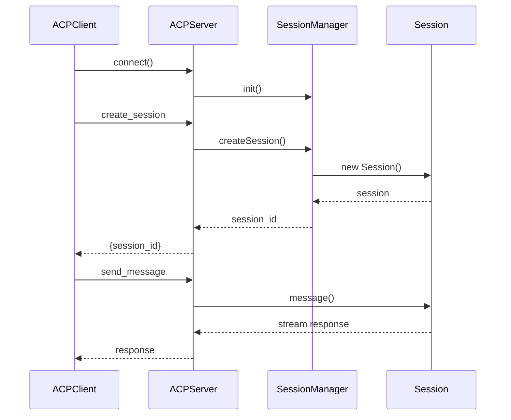

# Agent Client Protocol Flow

## Overview

**Flow ID**: `acp-agent-flow`
**Type**: Sequence
**Entry Point**: `packages/opencode/src/cli/cmd/acp.ts:16` (function: `AcpCommand`)

This flow implements the Agent Client Protocol (ACP), enabling standardized communication between OpenCode and external agent clients. ACP provides a protocol-level abstraction for agent-to-agent communication.

## Flow Diagram



## Flow Steps

### Step 1: Start ACP Server

**File**: `packages/opencode/src/cli/cmd/acp.ts`
**Function**: `AcpCommand.handler`
**Action**: Start ACP server for agent communication

Initializes the ACP server:
- Sets up protocol transport (stdio/socket)
- Registers ACP message handlers
- Configures session management
- Starts listening for connections

**Calls**: `ACPAgent`

### Step 2: Handle ACP Protocol Messages

**File**: `packages/opencode/src/acp/agent.ts`
**Function**: `ACPAgent`
**Action**: Handle ACP protocol messages

Processes ACP protocol messages:
- Message routing
- Protocol validation
- Session lifecycle management
- Error handling

**Calls**: `ACPSessionManager`, `Session`

### Step 3: Manage Agent Sessions

**File**: `packages/opencode/src/acp/session.ts`
**Function**: `ACPSessionManager`
**Action**: Manage agent sessions via ACP

Manages sessions through ACP:
- Session creation
- Message routing
- Session state tracking
- Cleanup and disposal

**Calls**: `Session.create`, `Session.message`

## ACP Protocol Messages

### Connection Messages

#### Initialize
```json
{
  "jsonrpc": "2.0",
  "method": "initialize",
  "params": {
    "protocolVersion": "1.0",
    "clientInfo": {
      "name": "example-client",
      "version": "1.0.0"
    }
  },
  "id": 1
}
```

#### Initialize Response
```json
{
  "jsonrpc": "2.0",
  "result": {
    "protocolVersion": "1.0",
    "serverInfo": {
      "name": "opencode",
      "version": "1.0.0"
    },
    "capabilities": {
      "tools": ["bash", "edit", "read", "write"],
      "streaming": true
    }
  },
  "id": 1
}
```

### Session Management

#### Create Session
```json
{
  "jsonrpc": "2.0",
  "method": "session/create",
  "params": {
    "model": "claude-3-sonnet",
    "tools": ["bash", "edit", "read"]
  },
  "id": 2
}
```

#### Create Session Response
```json
{
  "jsonrpc": "2.0",
  "result": {
    "sessionId": "abc123",
    "createdAt": "2025-10-25T14:30:00Z"
  },
  "id": 2
}
```

### Message Exchange

#### Send Message
```json
{
  "jsonrpc": "2.0",
  "method": "session/message",
  "params": {
    "sessionId": "abc123",
    "content": "help me build a feature"
  },
  "id": 3
}
```

#### Message Response (Streaming)
```json
{
  "jsonrpc": "2.0",
  "result": {
    "type": "text",
    "content": "I can help you with that..."
  },
  "id": 3
}
```

#### Tool Call Notification
```json
{
  "jsonrpc": "2.0",
  "method": "session/tool_call",
  "params": {
    "sessionId": "abc123",
    "tool": "bash",
    "params": {
      "command": "ls -la"
    }
  }
}
```

### Session Control

#### Delete Session
```json
{
  "jsonrpc": "2.0",
  "method": "session/delete",
  "params": {
    "sessionId": "abc123"
  },
  "id": 4
}
```

## Usage Examples

### Start ACP Server

```bash
# Start with stdio transport (default)
opencode acp

# Start with TCP socket
opencode acp --transport tcp --port 9000
```

### Python Client Example

```python
import json
import subprocess

# Start ACP server
proc = subprocess.Popen(
    ['opencode', 'acp'],
    stdin=subprocess.PIPE,
    stdout=subprocess.PIPE,
    text=True
)

# Send initialize
initialize_msg = {
    "jsonrpc": "2.0",
    "method": "initialize",
    "params": {
        "protocolVersion": "1.0",
        "clientInfo": {"name": "python-client", "version": "1.0.0"}
    },
    "id": 1
}
proc.stdin.write(json.dumps(initialize_msg) + '\n')
proc.stdin.flush()

# Read response
response = json.loads(proc.stdout.readline())
print(f"Server: {response['result']['serverInfo']['name']}")

# Create session
create_session_msg = {
    "jsonrpc": "2.0",
    "method": "session/create",
    "params": {"model": "claude-3-sonnet"},
    "id": 2
}
proc.stdin.write(json.dumps(create_session_msg) + '\n')
proc.stdin.flush()

session_response = json.loads(proc.stdout.readline())
session_id = session_response['result']['sessionId']
print(f"Session ID: {session_id}")
```

### TypeScript Client Example

```typescript
import { ACPClient } from '@agentclientprotocol/sdk';

// Connect to ACP server
const client = new ACPClient({
  command: 'opencode',
  args: ['acp']
});

await client.connect();

// Initialize
const initResponse = await client.initialize({
  protocolVersion: '1.0',
  clientInfo: {
    name: 'typescript-client',
    version: '1.0.0'
  }
});

// Create session
const session = await client.createSession({
  model: 'claude-3-sonnet',
  tools: ['bash', 'edit', 'read', 'write']
});

// Send message
const response = client.sendMessage(session.sessionId, {
  content: 'help me build a feature'
});

for await (const chunk of response) {
  if (chunk.type === 'text') {
    process.stdout.write(chunk.content);
  }
}
```

## Key Components Involved

- **ACP Command** - `packages/opencode/src/cli/cmd/acp.ts`
- **ACP Agent** - `packages/opencode/src/acp/agent.ts`
- **ACP Session Manager** - `packages/opencode/src/acp/session.ts`
- **Session** - `packages/opencode/src/session/index.ts`

## Protocol Features

### Capabilities

ACP server advertises these capabilities:
- Tool execution (bash, edit, read, write, grep, glob, etc.)
- Streaming responses
- Session management
- Multiple concurrent sessions
- Session persistence

### Transport Options

- **stdio** - Standard input/output (default)
- **TCP socket** - Network-based communication
- **Unix socket** - Local socket communication

## Error Handling

ACP follows JSON-RPC 2.0 error conventions:

```json
{
  "jsonrpc": "2.0",
  "error": {
    "code": -32600,
    "message": "Invalid Request",
    "data": {
      "details": "Missing required parameter: sessionId"
    }
  },
  "id": 3
}
```

### Error Codes

- `-32700` - Parse error
- `-32600` - Invalid request
- `-32601` - Method not found
- `-32602` - Invalid params
- `-32603` - Internal error
- `-32001` - Session not found
- `-32002` - Tool execution failed

## Security Considerations

- Protocol version validation
- Client capability negotiation
- Session isolation
- Sandboxed tool execution
- Resource limits per session

## Performance Considerations

- Connection multiplexing
- Streaming responses
- Lazy session initialization
- Efficient message serialization
- Connection pooling for multiple clients
