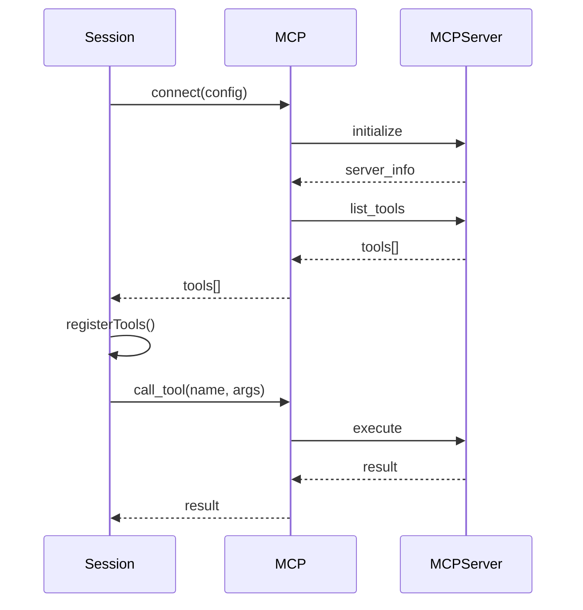

# Model Context Protocol Integration Flow

## Overview

**Flow ID**: `mcp-integration-flow`
**Type**: Sequence
**Entry Point**: `packages/opencode/src/mcp/index.ts:1` (function: `MCP.connect`)

This flow demonstrates how OpenCode integrates with Model Context Protocol (MCP) servers to extend its capabilities with external tools and context providers.

## Flow Diagram



## Flow Steps

### Step 1: Connect to MCP Server

**File**: `packages/opencode/src/mcp/index.ts`
**Function**: `MCP.connect`
**Action**: Connect to MCP server

Establishes connection with MCP server:
- Parses MCP server configuration
- Creates client instance
- Performs handshake
- Validates protocol version

**Calls**: `@modelcontextprotocol/sdk`

### Step 2: Fetch Available Tools

**File**: `packages/opencode/src/mcp/index.ts`
**Function**: `MCP.listTools`
**Action**: Fetch available tools from MCP server

Retrieves tool definitions:
- Sends list_tools request
- Receives tool schemas
- Validates tool definitions
- Caches tool metadata

**Calls**: `client.listTools`

### Step 3: Register MCP Tools

**File**: `packages/opencode/src/session/index.ts`
**Function**: `Session.registerMCPTools`
**Action**: Register MCP tools with session

Integrates MCP tools into session:
- Converts MCP schemas to internal format
- Registers tools in tool registry
- Makes tools available to AI
- Sets up tool execution handlers

**Calls**: `Tool.define`

## MCP Configuration

### Configuration File

MCP servers are configured in `.opencode/mcp.json`:

```json
{
  "servers": {
    "filesystem": {
      "command": "npx",
      "args": ["-y", "@modelcontextprotocol/server-filesystem", "/path/to/workspace"]
    },
    "github": {
      "command": "npx",
      "args": ["-y", "@modelcontextprotocol/server-github"],
      "env": {
        "GITHUB_TOKEN": "${GITHUB_TOKEN}"
      }
    },
    "sqlite": {
      "command": "npx",
      "args": ["-y", "@modelcontextprotocol/server-sqlite", "database.db"]
    }
  }
}
```

### Adding MCP Servers

```bash
# Add MCP server interactively
opencode mcp add

# List configured MCP servers
opencode mcp list

# Remove MCP server
opencode mcp remove filesystem
```

## Tool Discovery

When an MCP server connects, OpenCode discovers available tools:

```json
{
  "tools": [
    {
      "name": "read_file",
      "description": "Read contents of a file",
      "inputSchema": {
        "type": "object",
        "properties": {
          "path": {
            "type": "string",
            "description": "Path to file"
          }
        },
        "required": ["path"]
      }
    },
    {
      "name": "write_file",
      "description": "Write content to a file",
      "inputSchema": {
        "type": "object",
        "properties": {
          "path": {
            "type": "string",
            "description": "Path to file"
          },
          "content": {
            "type": "string",
            "description": "Content to write"
          }
        },
        "required": ["path", "content"]
      }
    }
  ]
}
```

## Tool Execution

When the AI requests an MCP tool:

```typescript
// AI requests MCP tool
const toolCall = {
  tool: 'mcp_filesystem_read_file',
  params: {
    path: '/path/to/file.txt'
  }
};

// OpenCode routes to MCP
const result = await mcp.callTool('filesystem', 'read_file', {
  path: '/path/to/file.txt'
});

// Result returned to AI
{
  content: "file contents...",
  isError: false
}
```

## Usage Examples

### Basic MCP Integration

```typescript
import { MCP } from './mcp';

// Connect to MCP server
const mcp = await MCP.connect({
  server: 'filesystem',
  command: 'npx',
  args: ['-y', '@modelcontextprotocol/server-filesystem', '/workspace']
});

// List available tools
const tools = await mcp.listTools();
console.log('Available tools:', tools.map(t => t.name));

// Call a tool
const result = await mcp.callTool('read_file', {
  path: '/workspace/file.txt'
});
console.log('File content:', result.content);

// Disconnect
await mcp.disconnect();
```

### Session with MCP Tools

```typescript
import { Session } from './session';
import { MCP } from './mcp';

// Create session
const session = await Session.create({
  model: 'claude-3-sonnet'
});

// Connect MCP servers
const filesystem = await MCP.connect({ server: 'filesystem', ... });
const github = await MCP.connect({ server: 'github', ... });

// Register MCP tools
await session.registerMCPTools(filesystem);
await session.registerMCPTools(github);

// Now AI can use MCP tools
const response = await session.message(
  'Read the README.md file and check the latest GitHub issues'
);
```

## Supported MCP Servers

OpenCode is compatible with any MCP-compliant server, including:

### Official MCP Servers

- `@modelcontextprotocol/server-filesystem` - File system operations
- `@modelcontextprotocol/server-github` - GitHub API integration
- `@modelcontextprotocol/server-sqlite` - SQLite database access
- `@modelcontextprotocol/server-postgres` - PostgreSQL database access
- `@modelcontextprotocol/server-memory` - Persistent memory storage

### Custom MCP Servers

OpenCode supports any custom MCP server that implements the protocol:

```javascript
// custom-mcp-server.js
import { MCPServer } from '@modelcontextprotocol/sdk';

const server = new MCPServer({
  name: 'custom-server',
  version: '1.0.0'
});

server.registerTool({
  name: 'custom_operation',
  description: 'Perform custom operation',
  inputSchema: {
    type: 'object',
    properties: {
      param: { type: 'string' }
    }
  },
  handler: async (params) => {
    // Custom logic
    return { result: 'success' };
  }
});

server.listen();
```

## Key Components Involved

- **MCP Integration** - `packages/opencode/src/mcp/index.ts`
- **Session Manager** - `packages/opencode/src/session/index.ts`
- **Tool Registry** - `packages/opencode/src/tool/registry.ts`
- **MCP Command** - `packages/opencode/src/cli/cmd/mcp.ts`

## Protocol Features

### Server Capabilities

MCP servers can provide:
- **Tools** - Executable functions
- **Resources** - File-like data sources
- **Prompts** - Reusable prompt templates
- **Sampling** - Text generation requests

### Client Capabilities

OpenCode as an MCP client supports:
- Tool execution
- Resource reading
- Prompt expansion
- Progress notifications
- Error handling

## Error Handling

MCP errors are handled gracefully:

```typescript
try {
  const result = await mcp.callTool('read_file', {
    path: '/nonexistent.txt'
  });
} catch (error) {
  if (error.code === 'TOOL_ERROR') {
    console.error('Tool execution failed:', error.message);
  } else if (error.code === 'SERVER_DISCONNECTED') {
    console.error('MCP server disconnected');
    // Attempt reconnection
  }
}
```

### Common Error Codes

- `TOOL_ERROR` - Tool execution failed
- `INVALID_PARAMS` - Invalid tool parameters
- `SERVER_DISCONNECTED` - Connection lost
- `PROTOCOL_ERROR` - Protocol violation
- `TIMEOUT` - Request timeout

## Security Considerations

- MCP servers run in separate processes
- Sandboxed execution environment
- Configuration validation
- Environment variable protection
- Resource access control

## Performance Considerations

- Connection pooling for multiple servers
- Lazy server initialization
- Tool result caching
- Efficient IPC communication
- Graceful degradation on server failure

## Advanced Usage

### Conditional Tool Registration

```typescript
// Only register MCP tools if server is available
if (await MCP.isAvailable('filesystem')) {
  const mcp = await MCP.connect({ server: 'filesystem', ... });
  await session.registerMCPTools(mcp);
}
```

### Tool Name Prefixing

MCP tools are automatically prefixed to avoid naming conflicts:

```
filesystem.read_file
filesystem.write_file
github.list_issues
github.create_pr
```

### Dynamic Server Discovery

```typescript
// Discover all configured MCP servers
const servers = await MCP.listConfigured();

// Connect to all servers
for (const server of servers) {
  const mcp = await MCP.connect(server);
  await session.registerMCPTools(mcp);
}
```
