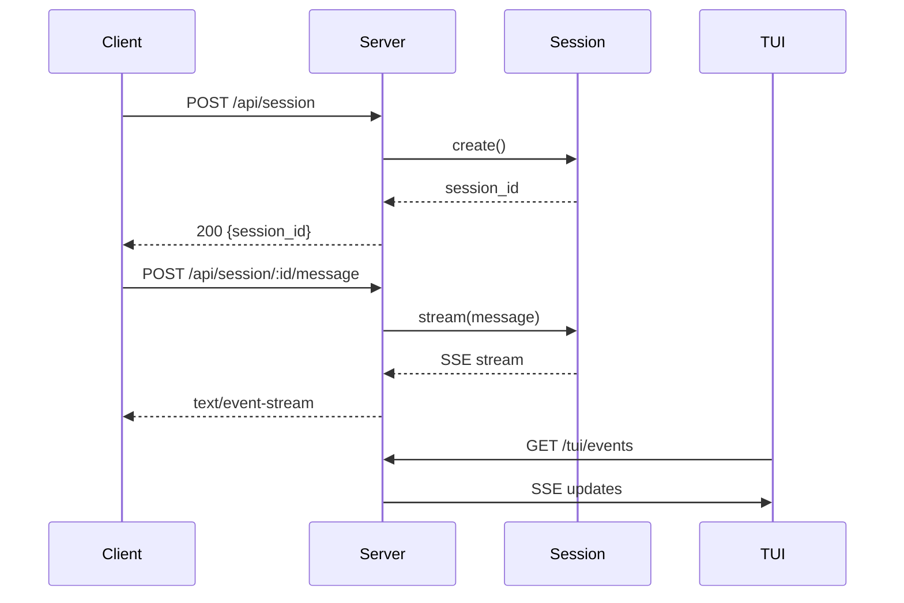

# Server Mode Flow

## Overview

**Flow ID**: `serve-command-flow`
**Type**: Sequence
**Entry Point**: `packages/opencode/src/cli/cmd/serve.ts:4` (function: `ServeCommand`)

This flow starts an HTTP server that provides remote access to OpenCode functionality. It enables web-based clients, the TUI, and other applications to interact with OpenCode over HTTP.

## Flow Diagram



## Flow Steps

### Step 1: Start HTTP Server

**File**: `packages/opencode/src/cli/cmd/serve.ts`
**Function**: `ServeCommand.handler`
**Action**: Start HTTP server for remote access

Initializes the HTTP server:
- Parses port configuration
- Sets up CORS policies
- Configures middleware
- Starts listening for requests

**Calls**: `Server`

### Step 2: Initialize Hono Server

**File**: `packages/opencode/src/server/server.ts`
**Function**: `Server`
**Action**: Initialize Hono server with routes

Sets up the server infrastructure:
- Creates Hono app instance
- Registers route handlers
- Configures error handling
- Sets up SSE endpoints

**Calls**: `ProjectRoute`, `TuiRoute`

### Step 3: Handle Project API Endpoints

**File**: `packages/opencode/src/server/project.ts`
**Function**: `ProjectRoute`
**Action**: Handle project-related API endpoints

Manages project-level operations:
- Session creation
- Message handling
- Session listing
- Session deletion

**Calls**: `Session.create`, `Session.stream`

### Step 4: Handle TUI Communication

**File**: `packages/opencode/src/server/tui.ts`
**Function**: `TuiRoute`
**Action**: Handle TUI communication

Manages TUI-specific endpoints:
- Event streaming to TUI
- User input handling
- State synchronization
- Real-time updates

**Calls**: `Bus.publish`, `Bus.subscribe`

## API Endpoints

### Session Management

#### Create Session
```http
POST /api/session
Content-Type: application/json

{
  "model": "claude-3-sonnet",
  "tools": ["bash", "edit", "read", "write"]
}

Response:
{
  "session_id": "abc123",
  "created_at": "2025-10-25T14:30:00Z"
}
```

#### Send Message
```http
POST /api/session/:id/message
Content-Type: application/json

{
  "content": "help me build a feature"
}

Response: text/event-stream (SSE)
```

#### List Sessions
```http
GET /api/sessions

Response:
{
  "sessions": [
    {
      "id": "abc123",
      "created_at": "2025-10-25T14:30:00Z",
      "last_message": "2025-10-25T15:00:00Z"
    }
  ]
}
```

#### Delete Session
```http
DELETE /api/session/:id

Response:
{
  "success": true
}
```

### TUI Endpoints

#### Event Stream
```http
GET /tui/events

Response: text/event-stream (SSE)
```

#### Send Input
```http
POST /tui/input
Content-Type: application/json

{
  "type": "keypress",
  "value": "enter"
}
```

## Usage Examples

### Start Server

```bash
# Start on default port (3000)
opencode serve

# Start on custom port
opencode serve --port 8080
```

### Client Examples

#### JavaScript Client
```javascript
// Create session
const response = await fetch('http://localhost:3000/api/session', {
  method: 'POST',
  headers: { 'Content-Type': 'application/json' },
  body: JSON.stringify({
    model: 'claude-3-sonnet'
  })
});
const { session_id } = await response.json();

// Send message and stream response
const eventSource = new EventSource(
  `http://localhost:3000/api/session/${session_id}/message`
);
eventSource.onmessage = (event) => {
  const data = JSON.parse(event.data);
  console.log(data.content);
};
```

#### cURL Example
```bash
# Create session
curl -X POST http://localhost:3000/api/session \
  -H "Content-Type: application/json" \
  -d '{"model": "claude-3-sonnet"}'

# Send message
curl -X POST http://localhost:3000/api/session/abc123/message \
  -H "Content-Type: application/json" \
  -d '{"content": "help me build a feature"}' \
  --no-buffer
```

## Key Components Involved

- **Serve Command** - `packages/opencode/src/cli/cmd/serve.ts`
- **Server** - `packages/opencode/src/server/server.ts`
- **Project Routes** - `packages/opencode/src/server/project.ts`
- **TUI Routes** - `packages/opencode/src/server/tui.ts`
- **Session Manager** - `packages/opencode/src/session/index.ts`

## Server-Sent Events (SSE)

The server uses SSE for real-time communication:

```
event: text
data: {"content": "I can help you with that..."}

event: tool_call
data: {"tool": "bash", "params": {"command": "ls"}}

event: tool_result
data: {"result": "file1.txt\nfile2.txt"}

event: done
data: {"tokens": 1234}
```

## Security Considerations

- CORS configuration for allowed origins
- Authentication via tokens (optional)
- Rate limiting per session
- Input validation on all endpoints
- Sandbox restrictions for tool execution

## Error Handling

The server includes comprehensive error handling:
- Invalid requests → 400 Bad Request
- Session not found → 404 Not Found
- Server errors → 500 Internal Server Error
- Tool execution errors → Graceful error messages
- Connection drops → Automatic reconnection support

## Performance Considerations

- Connection pooling for multiple clients
- Session state caching
- SSE connection management
- Non-blocking I/O operations
- Graceful shutdown handling
