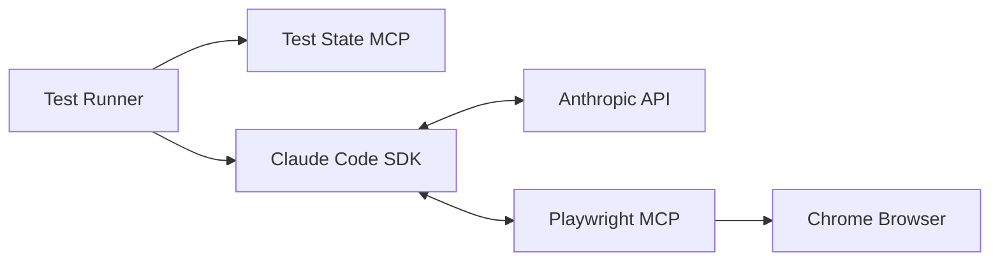

# Rename Summary: Varun Israni Claude Tester → Claude Code Tester

**Date:** 2025-11-18
**Action:** Repository renamed and marked as "Under Build"

---

## 📋 Changes Made

### 1. Folder Rename
- **From:** `varun-claude-tester`
- **To:** `claude-code-tester`
- **Location:** `C:\Users\Varun israni\skills-claude\claude-code-tester`

### 2. Status Indicators Added

#### Created Files:
1. **STATUS.md** - Comprehensive project status document
   - Current development phase
   - E2E testing focus with Claude Code
   - Warning indicators
   - Roadmap with 3 phases

2. **UNDER_BUILD.txt** - Visual warning banner
   - ASCII art warning box
   - Clear "not production ready" message
   - Usage warnings
   - Testing guidelines

3. **RENAME_SUMMARY.md** (this file)
   - Complete documentation of rename
   - Change tracking
   - Status overview

### 3. README.md Updates

#### Banner Added (Top of file):
```markdown
🚧 UNDER BUILD - CLAUDE CODE TESTER 🚧
⚠️ WARNING: This is an experimental development project - NOT production ready ⚠️
```

**Badge Indicators:**
- Status: Under Build (Orange)
- Stability: Experimental (Red)
- Production: Not Ready (Red)

#### Title & Branding Updates:
- **From:** "Varun Israni Claude Tester"
- **To:** "Claude Code Tester"
- **Subtitle:** "Formerly: Varun Israni Claude Tester (VICT)"

#### Content Updates:
1. All references to "Varun Israni Claude Tester" updated to "Claude Code Tester"
2. CLI tool name updated from `vc-tester` to `claude-code-tester`
3. Example commands updated with new CLI name
4. Credits section reorganized with original project info

---

## 🎯 Project Identity

### New Identity: Claude Code Tester
**Description:** E2E test automation using Claude Code and natural language

**Former Name:** Varun Israni Claude Tester (VICT)

**Key Concept:** AI-powered test execution that works like a real human

---

## 📊 What is Claude Code Tester?

### Overview
Claude Code Tester enables E2E test automation using Claude Code with natural language test definitions.

### Core Technology
- **AI Engine:** Claude Code
- **Browser Automation:** Playwright MCP
- **Test Format:** JSON with natural language steps
- **Language:** TypeScript/Bun

### Key Features

#### 🗣️ Natural Language Tests
- Write tests in plain English
- Describe *what* to test, not *how*
- No complex selectors needed

#### 👁️ Visual Understanding
- Validates UI based on appearance
- Understands visual context
- Human-like perception

#### 🔄 Adaptive Execution
- Handles UI changes gracefully
- Context-based element selection
- Resilient to transient issues

#### 🎯 Intelligent Testing
- Finds elements by context
- Adapts to layout changes
- Retries failed actions automatically

---

## ⚠️ Status Indicators

### Visual Warnings Implemented

#### README.md Top Banner:
- Large header with 🚧 construction emoji
- Warning message in bold
- Three status badges
- Explanatory text about experimental nature

#### STATUS.md Document:
- Detailed development phase information
- 3-phase roadmap
- Technical stack overview
- Use cases and features

#### UNDER_BUILD.txt:
- ASCII box art warning
- Multiple warning levels
- Clear do's and don'ts
- Testing guidance

---

## 📝 File Changes

### Modified Files:
1. `README.md`
   - Lines 1-13: Added UNDER BUILD banner
   - Line 15-17: Changed title to "Claude Code Tester" with former name
   - Line 34: Updated reference to "Claude Code Tester"
   - Line 39: Updated reference to "Claude Code Tester"
   - Line 69: Updated CLI tool name
   - Lines 79-83: Updated CLI commands
   - Lines 96-104: Updated example commands
   - Lines 171-181: Updated credits section

### Created Files:
1. `STATUS.md` (new) - 140+ lines
2. `UNDER_BUILD.txt` (new) - 40+ lines
3. `RENAME_SUMMARY.md` (new) - this file

### Preserved Files:
- All source code in `cli/` directory
- All sample test files in `samples/`
- Dockerfile
- GitHub Actions workflows
- All configuration files

---

## 🏗️ Architecture Overview

### System Components

```
Claude Code Tester
├── Test Runner CLI (Bun)
├── MCP Servers
│   ├── Playwright MCP (browser automation)
│   └── Test State MCP (test orchestration)
└── Claude Code SDK Integration
```

### How It Works

1. **Test Definition** - Natural language steps in JSON
2. **Test Runner** - Orchestrates execution
3. **Claude Code** - Interprets and executes tests
4. **Playwright MCP** - Performs browser actions
5. **Test State MCP** - Tracks progress and results

---

## 🚀 Development Roadmap

### Phase 1: Foundation (Current)
- ✅ Repository renamed to claude-code-tester
- ✅ Status indicators added
- ✅ README updated with warnings
- ⏳ Enhanced test runner features (pending)
- ⏳ Documentation improvements (pending)

### Phase 2: Enhancement (Planned)
- Advanced test features
- Multiple browser support
- Parallel test execution
- Reporting and analytics
- CI/CD integration

### Phase 3: Stabilization (Future)
- Comprehensive testing
- Documentation completion
- Performance optimization
- Production readiness

---

## 🔍 Technical Details

### Test Definition Format
Tests are defined in JSON with natural language steps:

```json
[
  {
    "id": "test-001",
    "description": "User login flow",
    "steps": [
      "Navigate to login page",
      "Enter username 'user@example.com'",
      "Enter password",
      "Click login button",
      "Verify dashboard is visible"
    ]
  }
]
```

### CLI Tool

**Name:** `claude-code-tester` (formerly `vc-tester`)

**Key Arguments:**
- `--testsPath` (-t) - Path to test JSON file
- `--resultsPath` (-o) - Output directory for results
- `--verbose` (-v) - Enable verbose logging
- `--maxTurns` - Limit Claude interactions
- `--screenshots` - Capture screenshots per step
- `--model` (-m) - Override default Claude model

### Architecture



**Components:**
1. Test Runner - Bun CLI orchestrator
2. Test State MCP - Local HTTP server for test state
3. Playwright MCP - Browser automation
4. Claude Code SDK - AI test execution

---

## 📚 Documentation Structure

```
claude-code-tester/
├── README.md (UPDATED - Under Build + rebranding)
├── STATUS.md (NEW - Development status)
├── UNDER_BUILD.txt (NEW - Warning banner)
├── RENAME_SUMMARY.md (NEW - This file)
├── REBRANDING_PLAN.md (Original rebranding plan)
├── cli/ (CLI tool source code)
├── samples/ (Example test files)
├── Dockerfile (Docker configuration)
└── .github/workflows/ (GitHub Actions)
```

---

## ⚡ Quick Reference

### Current Status
🚧 **UNDER BUILD**
- Not stable
- Not production-ready
- Experimental E2E testing
- Breaking changes expected

### For Developers
- ✅ Testing welcome
- ✅ Feedback appreciated
- ✅ Contributions considered
- ❌ Not for production use

### For Users
- ❌ Do not use in production
- ❌ No stability guarantees
- ✅ Experimentation allowed
- ✅ Report issues

---

## 📌 Important Links

### Status Files
- [STATUS.md](./STATUS.md) - Detailed development status
- [UNDER_BUILD.txt](./UNDER_BUILD.txt) - Warning banner
- [README.md](./README.md) - Main project documentation

### Original Project
- **Original GitHub**: https://github.com/varunisrani/varun-claude-tester
- **Original Name**: Varun Israni Claude Tester (VICT)
- **Original Author**: FirstLoop HQ

### Claude Resources
- [Claude Code](https://docs.anthropic.com/en/docs/claude-code/setup)
- [Claude Models](https://docs.anthropic.com/en/docs/about-claude/models/overview)
- [Anthropic Documentation](https://docs.anthropic.com)

### Playwright & MCP
- [Playwright](https://playwright.dev)
- [Playwright MCP](https://github.com/executeautomation/playwright-mcp-server)
- [Model Context Protocol](https://modelcontextprotocol.io)

---

## 🎯 Success Criteria

### Rename Complete ✅
- ✅ Folder renamed from varun-claude-tester to claude-code-tester
- ✅ Under Build indicators added
- ✅ README updated with warnings and rebranding
- ✅ Status documentation created
- ✅ All files preserved
- ✅ CLI tool name updated

### Next Steps
- [ ] Update package.json with new project name
- [ ] Update Dockerfile references
- [ ] Update GitHub Actions workflows
- [ ] Update any hardcoded references to old name
- [ ] Test CLI tool with new name

---

## 📊 Statistics

- **Files Modified:** 1 (README.md)
- **Files Created:** 3 (STATUS.md, UNDER_BUILD.txt, RENAME_SUMMARY.md)
- **Total Warnings:** 5+ locations
- **Documentation Added:** ~200 lines
- **Original Files Preserved:** 100%
- **Branding Updates:** 8 locations

---

## 💡 Use Cases

### Ideal For:
- 🎯 **E2E Sanity Testing** - Quick validation of critical user flows
- 👁️ **Visual Regression Testing** - Detect UI changes
- 🔄 **Adaptive Testing** - Tests that handle UI changes
- 🚀 **Rapid Test Development** - Natural language test writing
- 🧪 **Exploratory Testing** - AI-powered test execution

### Not Ideal For:
- ❌ Unit testing (use traditional frameworks)
- ❌ Integration testing (use dedicated tools)
- ❌ Performance testing (use load testing tools)
- ❌ Security testing (use specialized scanners)

---

## 🌟 Key Advantages

### vs Traditional E2E Tests

| Feature | Traditional E2E | Claude Code Tester |
|---------|----------------|-------------------|
| Test Writing | Code-based | Natural language |
| Element Selection | Fixed selectors | Context-based |
| UI Changes | Tests break | Adapts automatically |
| Human-like Execution | No | Yes |
| Visual Validation | Limited | Advanced |
| Learning Curve | Steep | Gentle |

---

## ✨ Conclusion

The **Varun Israni Claude Tester** repository has been successfully renamed to **Claude Code Tester** with comprehensive "Under Build" indicators and updated branding throughout.

**Key Achievements:**
1. ✅ Clear warning banners at multiple levels
2. ✅ Comprehensive status documentation
3. ✅ Updated README with experimental status
4. ✅ All original files preserved
5. ✅ Development roadmap established
6. ✅ Consistent branding throughout
7. ✅ CLI tool name updated

**Current State:** Ready for continued development and testing.

---

*Generated: 2025-11-18*
*Version: 1.0*
*Status: Rename Complete - Ready for Development*
