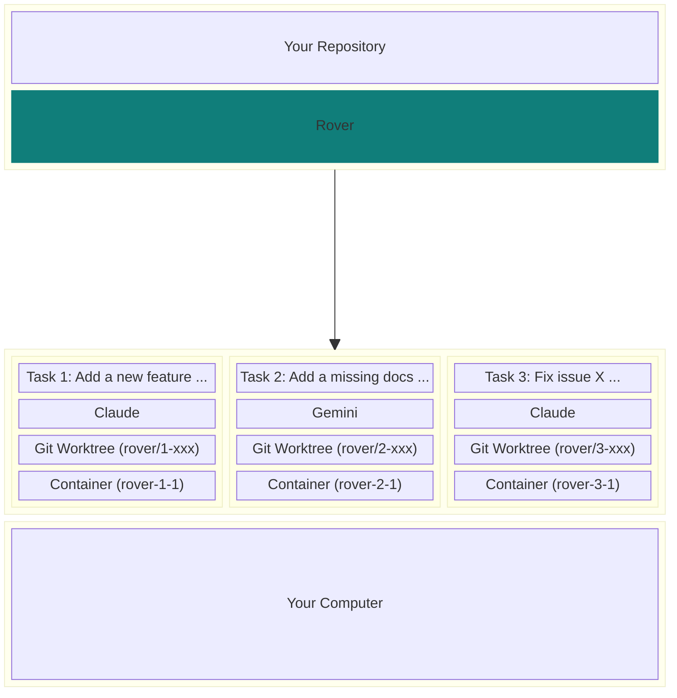

<div align="center">
  <a href="https://endor.dev/rover">
    <picture>
      <source media="(prefers-color-scheme: dark)" srcset="https://github.com/user-attachments/assets/d53e2e6d-2dac-4999-b1c9-63961035ffd9">
      
    </picture>
  </a>
  <h1>Rover</h1>

<a href="https://endor.dev"></a>
<a href="https://www.npmjs.com/package/@endorhq/rover"></a>
<a href="https://github.com/endorhq/rover/blob/main/license.md"></a>
<a href="https://discord.gg/ruMJaQqVKa"></a>

</div>

Rover is a **manager for AI coding agents that works with Claude Code, Codex, Gemini, and Qwen**.

It helps you get more done, faster, by allowing **multiple agents to work on your codebase simultaneously**. The agents work in the background in separate, isolated environments: they don't interfere with your work or each other.

**Rover does not change how you work**: everything runs locally, under your control, and using your already installed tools.

## Getting Started

First, install Rover and initialize it in your project:

```sh
# Install
npm install -g @endorhq/rover@latest

# Initialize
cd <your-project> && rover init .
```

_The init step checks what type of project it is and which coding agents and development tools you use (such as Claude Code and Docker)._

Then, run `rover task` to create a task describing what you want to accomplish in your project and hand it to Rover.


Rover will:

- 🔒 Prepare a **local isolated environment** (using containers) with an independent copy of your project code
- ⚙️ **Install and configure** your preferred AI coding agent in that environment
- 🤖 Setup a workflow for the agent to complete the task and **run it in the background until it finishes**
- 📖 Collect a set of **developer-friendly documents** with information about the changes in the code

Depending on the task complexity, it might take a few minutes. Meanwhile, you **can create new tasks and run them in parallel** or simply relax, step back and do some other work, whether on your computer or away from it!

## Why Rover?

Running and managing multiple AI coding agents simultaneously can be overwhelming. You need to run them isolated from each other and they constantly ask for attention. **Context switching quickly becomes a productivity drain**.

At the same time, **parallel execution is one of the most powerful capabilities of AI coding agents**. You can focus on a task while a team of agents complete small issues, start another task, or just write some documentation.

To simplify this process, **Rover manages AI coding agents on your behalf**. It integrates with both your terminal and VSCode (as an extension).



### Main features

- 🚀 **Easy to use**: Manage multiple AI coding agents working on different tasks with a single command
- 🔒 **Isolated**: Prevent AI Agents from overriding your changes, accessing private information or deleting system files
- 🤖 **Bring your AI agents**: Use your existing AI agents like Claude Code, Codex, Gemini, and Qwen. **No new subscriptions needed**
- 💻 **Local**: Everything runs on your computer. No new apps and permissions in your repositories
- 👐 **Open Source**: Released under the Apache 2 license

## Quickstart

### Prerequisites

- [Node.js 22+](https://nodejs.org/en/download)
- [Git](https://git-scm.com/downloads)
- [Docker](https://docs.docker.com/engine/install/)

You need at least one supported AI agent in your system:

- [Claude Code](https://docs.anthropic.com/en/docs/claude-code/setup)
- [Codex](https://github.com/openai/codex?tab=readme-ov-file#installing-and-running-codex-cli)
- [Gemini CLI](https://github.com/google-gemini/gemini-cli?tab=readme-ov-file#-installation)
- [Qwen Code](https://github.com/QwenLM/qwen-code?tab=readme-ov-file#installation)

### Installation

- [Terminal](#terminal)
- [VSCode](#vscode)

#### Terminal

Install it using `npm`:

```sh
npm install -g @endorhq/rover@latest
```

### First steps

1. Initialize Rover in your project:

   ```sh
   cd <your-project> && rover init .
   ```

2. Create your first task with Rover:

   ```sh
   rover task
   ```

3. Check the status of your task:

   ```sh
   rover ls -w
   ```

4. Keep working on your own tasks 🤓

5. After finishing, check the task result:

   ```sh
   rover inspect 1
   rover inspect 1 --file changes.md
   rover diff 1
   ```

6. If you want to apply more changes, create a second iteration with new instructions:

   ```sh
   rover iterate 1
   ```

7. If you need to apply changes manually, jump into the task workspace:

   ```sh
   rover shell 1
   ```

8. If changes are fine, you can:
   - Merge them:

   ```sh
   rover merge 1
   ```

   - Push the branch to the remote using your git configuration:

   ```sh
   rover push 1
   ```

   - Take manual control:

   ```sh
   rover shell 1
   git status
   ```

> 💡 TIP: You can run multiple tasks in parallel. Just take into account your AI agents' limits.

#### VSCode

Rover is available on the [VSCode Marketplace](https://marketplace.visualstudio.com/vscode). You can look for `Rover` in your VSCode Extensions Panel or access the [Marketplace page](https://marketplace.visualstudio.com/items?itemName=endorhq.rover) and click `Install` there.

If the Rover CLI is not in the `PATH` or the project is not initialized, the extension will guide you through the initialization process. Once everything is ready, you will be able to create your first task!

See the [VSCode documentation site](https://docs.endor.dev/rover/vscode-extension/).

## How it works

**Rover relies on local tools you already have like Git, Docker/Podman and AI coding agents**. When you initialize it in a project (using `rover init`), it identifies the project requirements and the available tools in your environment.

Once you create a task, Rover creates a separate _git worktree_ (`workspace`) and branch for that task. It starts a container, mounts the required files, installs tools, configures them, and lets your AI agent complete a workflow. Rover workflows are a set of predefined steps for AI coding agents. Depending on the workflow, you might get a set of changes in the workspace or a document with research.

After an AI agent finishes the task, all code changes and output documents are available in the task workspace (_git worktree_). You can inspect those documents, check changes, iterate with an AI agent, or even take full control and start applying changes manually. **Every developer has a different workflow, and Rover won't interfere with it**.

Once you are ready, you can merge changes or push the branch. That's it! 🚀

### Report Issues

Found a bug or have a feature request? Please [open an issue on GitHub](https://github.com/endorhq/rover/issues). We appreciate detailed bug reports and thoughtful feature suggestions.

### Join the Community

We'd love to hear from you! Whether you have questions, feedback, or want to share what you're building with Rover, there are multiple ways to connect.

- **Discord**: [Join our Discord spaceship](https://discord.gg/ruMJaQqVKa) for real-time discussions and help
- **Twitter/X**: Follow us [@EndorHQ](https://twitter.com/EndorHQ) for updates and announcements
- **Mastodon**: Find us at [@EndorHQ@mastodon.social](https://mastodon.social/@EndorHQ)
- **Bluesky**: Follow [@endorhq.bsky.social](https://bsky.app/profile/endorhq.bsky.social)

## License

Rover is open source software licensed under the Apache 2.0 License.

---

<div align="center">

**Built with ❤️ by the Endor team**

_We build tools to make AI coding agents better_

</div>
