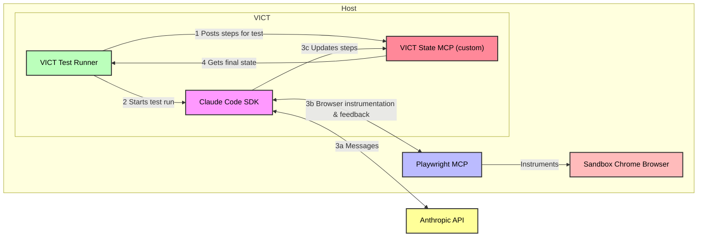

# Varun Israni Claude Tester (VICT)

> Created by **Varun Israni** - AI-Powered E2E Test Automation Framework

This project enables full E2E test automation using Claude Code powered by VICT.

Tests are defined using simple natural language steps.
Claude Code performs these steps sequentially in a browser through the Playwright MCP,
making decisions about element selection, timing,
and validation based on the test descriptions.

## Why VICT as a test runner?

Professional software engineers have been successfully writing automated tests for decades.
With the introduction of tools like Claude Code, traditional tests can be written even faster.
Why would anyone use VICT as a test runner?

First, this test runner was not made to replace traditional unit, integration, or manual testing strategies.
It is meant to bolster confidence in the final end-to-end experience of your web application.
Ideally, VICT sits somewhere between traditional automated E2E tests
and manual E2E sanity tests.

### Claude Code can execute tests like a real human

Imagine performing manual E2E tests with human-like intuition dozens or hundreds of times each day. That's what VICT can deliver.

- **Natural language test definitions**: Tests describe what to test rather than how to test it
- **Visual understanding**: Can validate UI states based on visual appearance
- **Highly scalable**: Run as many tests as you are willing to pay for (requires Claude Code subscriptions or incurs API costs).

### Claude Code can roll with the punches

E2E tests typically tie together a large number of discrete systems.
A lot can happen in the span of a single test,
and it is difficult to write traditional E2E tests that account for every edge case. 

Claude Code is highly adaptive. It is not tripped up by network blips, minor UX updates, 
or other innocuous changes and hiccups. It's the perfect test runner for environments
where a lot can go wrong.

- **Adaptive element selection**: Finds elements based on context rather than fixed selectors
- **UI change adaptation**: When elements move or change appearance, Claude Code uses context and visual cues to locate them rather than failing on selector mismatches
- **Resilient to transient issues**: Claude Code can retry failed actions, wait for loading states, and handle network delays without explicit instructions

## Usage

### Test Definitions

Tests are defined in JSON using sequential, natural language steps.
The expected schema is a JSON array of [TestCase](cli/src/types/test-case.ts) objects.
See [samples/vict-sample-tests.json](samples/vict-sample-tests.json) for a concrete example.

### CLI

This project includes a CLI tool, `vict-runner`.

#### Building the CLI Tool

Initialize your environment: `cd cli && ./init.dev.sh`.

Build the CLI: `bun run build`

#### Running the CLI Tool

```bash
./dist/vict-runner [options]
```

| Argument | Alias | Type | Required | Default | Description |
|----------|-------|------|----------|---------|-------------|
| `--testsPath` | `-t` | string | Yes | - | Path to the JSON file containing test definitions |
| `--resultsPath` | `-o` | string | No | `./results` | Directory where test results will be saved |
| `--verbose` | `-v` | boolean | No | `false` | Enable verbose output including all Claude Code messages |
| `--maxTurns` | - | number | No | `30` | Maximum number of interactions Claude Code can make per test case |
| `--screenshots` | - | boolean | No | `false` | Whether to take screenshots upon completion of each test step. Note: this can significantly increase the number of tool calls made by Claude and slow test execution. |
| `--model` | `-m` | string | No | Claude Code default | Override the default model with one from https://docs.anthropic.com/en/docs/about-claude/models/overview. Depending on the complexity of the test case, Claude Haiku 3.5 can do a solid job. |

#### Example Commands

```bash
# Basic usage with test file
./dist/vict-runner --testsPath=./tests.json

# With custom results directory and verbose output
./dist/vict-runner -t ./e2e-tests.json -o ./test-output -v

# Limit Claude Code interactions
./dist/vict-runner --testsPath=./tests.json --maxTurns=20
```

### Docker Image + GitHub Actions

The CLI described above is also bundled into a Docker container, available on GHCR.
This container can be used directly in GitHub actions, as demonstrated [here](.github/workflows/sample-tests-action.yml)

IMPORTANT: you must provide either an OAuth token or API key via the `CLAUDE_CODE_OAUTH_TOKEN` or `ANTHROPIC_API_KEY` env vars.

### Debugging and logs

The results directory for each test run contains the following:

- Overall test results:
    - CTRF format: `{results path}/ctrf-report.json`
    - Markdown: `{results path}/test-summary.md`
- Per test Playwright traces: `{results path}/{test case id}/traces`
- Per test screenshots taken by Claude Code at critical points of the test: `{results path}/{test case id}/*.png`

## Architecture



The system has three main components:

1. **VICT Runner CLI**: Bun-based orchestrator that manages test execution.
2. **MCP Servers**: Model Context Protocol implementations for:
   - **Playwright MCP**: Provides browser automation capabilities through standard MCP tools
   - **VICT State MCP**: A local HTTP server that maintains test execution state, tracks step completion, and enables Claude Code to query the current test plan and update progress in real-time
3. **Claude Code Integration**: Executes test steps using the Claude Code SDK

The VICT State MCP server is particularly important as it provides a feedback loop between the test runner and Claude Code.
It exposes two main tools:
- `get_test_plan`: Returns the current test case definition and step statuses
- `update_test_step`: Allows Claude Code to mark steps as passed/failed with error details

This architecture ensures Claude Code always knows what test it's executing and can report results back to the VICT runner,
enabling proper test orchestration and reporting.
