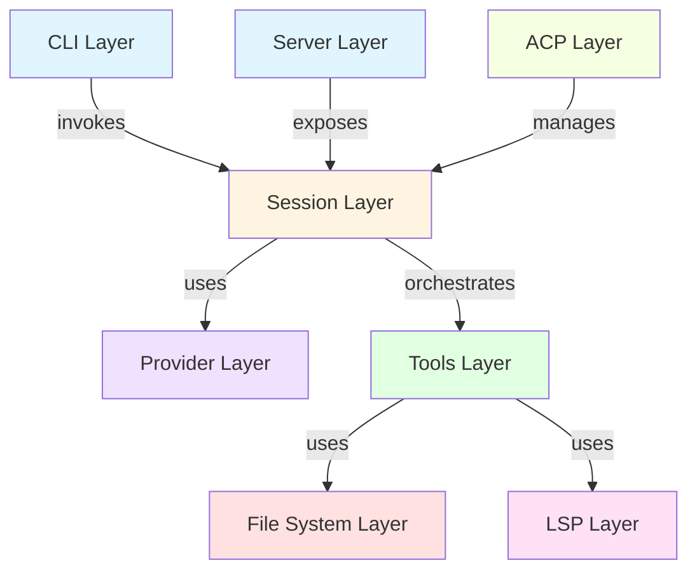

# Architecture

## Overview

OpenCode is a multi-language, client/server AI coding agent with a monorepo architecture. It consists of a TypeScript core CLI (using Bun), a Go-based TUI, SDKs in multiple languages, and web interfaces built with SolidJS and Astro.

## Architecture Style

OpenCode follows a **client-server architecture with protocol-based communication**. The system is organized into clear layers with separation of concerns.

## Design Patterns

- **Tool Registry Pattern** - Centralized tool registration and execution
- **Session Management** - Stateful conversation management with AI
- **Provider Abstraction** - Unified interface for multiple AI providers
- **Event Bus** - Pub/sub pattern for component communication
- **Command Pattern** - CLI command handlers with consistent interface

## Component Layers

### Protocol Layer
Implements various protocols for extensibility and interoperability:
- `packages/opencode/src/acp` - Agent Client Protocol
- `packages/opencode/src/lsp` - Language Server Protocol
- `packages/opencode/src/mcp` - Model Context Protocol

### CLI Layer
Command-line interface and argument parsing:
- `packages/opencode/src/cli` - CLI command handlers

### Server Layer
HTTP server for remote access:
- `packages/opencode/src/server` - Hono-based HTTP server

### Agent Layer
Core agent logic and session orchestration:
- `packages/opencode/src/agent` - Agent orchestration
- `packages/opencode/src/session` - Session management

### Tools Layer
Tool implementations for AI actions:
- `packages/opencode/src/tool` - 36+ tool implementations

### Providers Layer
AI provider integrations:
- `packages/opencode/src/provider` - Multi-provider support

### File System Layer
File operations and watching:
- `packages/opencode/src/file` - File utilities (fzf, ripgrep, watcher)

### UI Layer
User interface implementations:
- `packages/tui` - Go-based terminal UI
- `packages/desktop` - Electron-based desktop app
- `packages/ui` - SolidJS component library
- `packages/web` - Astro documentation site

## Dependency Graph

## Internal Dependencies

### CLI → Session
- **Import Count**: 15
- **Description**: CLI commands invoke session management
- **Components**:
  - From: `packages/opencode/src/cli`
  - To: `packages/opencode/src/session`

### Session → Provider
- **Import Count**: 8
- **Description**: Sessions use AI providers
- **Components**:
  - From: `packages/opencode/src/session`
  - To: `packages/opencode/src/provider`

### Session → Tool
- **Import Count**: 12
- **Description**: Sessions orchestrate tool execution
- **Components**:
  - From: `packages/opencode/src/session`
  - To: `packages/opencode/src/tool`

### Tool → File
- **Import Count**: 6
- **Description**: Tools use file operations
- **Components**:
  - From: `packages/opencode/src/tool`
  - To: `packages/opencode/src/file`

### Tool → LSP
- **Import Count**: 2
- **Description**: LSP tools use language server
- **Components**:
  - From: `packages/opencode/src/tool`
  - To: `packages/opencode/src/lsp`

### Server → Session
- **Import Count**: 5
- **Description**: Server exposes session APIs
- **Components**:
  - From: `packages/opencode/src/server`
  - To: `packages/opencode/src/session`

### ACP → Session
- **Import Count**: 3
- **Description**: ACP manages agent sessions
- **Components**:
  - From: `packages/opencode/src/acp`
  - To: `packages/opencode/src/session`

## External Dependencies

| Dependency | Purpose | Layer |
|------------|---------|-------|
| `yargs` | CLI argument parsing | CLI |
| `hono` | HTTP server framework | Server |
| `ai` | Unified AI provider SDK | Provider |
| `@anthropic-ai/sdk` | Anthropic Claude integration | Provider |
| `@modelcontextprotocol/sdk` | MCP protocol | Protocol |
| `@agentclientprotocol/sdk` | ACP protocol | Protocol |
| `tree-sitter` | Code parsing | Tools |
| `@parcel/watcher` | File watching (primary) | File System |
| `chokidar` | File watching (fallback) | File System |
| `zod` | Schema validation | All layers |
| `solid-js` | UI framework | UI |
| `vite` | Frontend build | UI |
| `astro` | Static site generation | UI |
| `sst` | Infrastructure deployment | Infrastructure |
| `@openauthjs/openauth` | Authentication | Auth |

## Technology Stack

### Runtime Environment

| Component | Technology | Version |
|-----------|-----------|---------|
| Primary Runtime | Bun | 1.3.0+ |
| Secondary Runtime | Node.js | 22+ |
| Go Runtime | Go | 1.21+ |

### Package Management & Build

| Component | Technology |
|-----------|-----------|
| Package Manager | Bun (workspace support) |
| Build Tool | Turbo |

### Frameworks

| Category | Framework | Purpose |
|----------|-----------|---------|
| CLI | Yargs | Command-line interface |
| Backend | Hono | HTTP server |
| Frontend | SolidJS | Reactive UI |
| Documentation | Astro | Static site |
| Infrastructure | SST | IaC and deployment |

### AI Providers

OpenCode supports multiple AI providers through a unified abstraction:

- Anthropic (Claude)
- OpenAI
- Google Vertex AI
- Amazon Bedrock
- Local models

### Protocols

| Protocol | Full Name | Purpose |
|----------|-----------|---------|
| MCP | Model Context Protocol | Tool and context sharing |
| ACP | Agent Client Protocol | Agent communication |
| LSP | Language Server Protocol | Code intelligence |

### Testing

| Component | Technology |
|-----------|-----------|
| Test Framework | Bun test |
| Test Runner | Built into Bun |

## Code Organization

OpenCode uses **feature-based modules with clear separation of concerns**:

- Each component has a single responsibility
- Protocol implementations are isolated
- Tools are independently defined and registered
- Providers are abstracted behind a common interface
- UI implementations are separated by platform

## Data Flow

1. **User Input** → CLI/TUI/Server
2. **Command Parsing** → CLI layer
3. **Session Creation** → Session layer
4. **AI Request** → Provider layer
5. **Tool Execution** → Tools layer
6. **File Operations** → File System layer
7. **Response Streaming** → Back to user interface

## Configuration

Configuration is managed through:
- Config files (`.opencode/config.json`)
- Environment variables
- CLI arguments
- Default values

## Authentication

Authentication is handled through the `auth` component:
- GitHub Copilot authentication
- Token-based auth for server mode
- OAuth integration via OpenAuth

## Extensibility Points

OpenCode is designed for extensibility:

1. **Custom Tools** - Register new tools via Tool Registry
2. **Custom Providers** - Implement provider interface
3. **MCP Servers** - Connect external MCP servers
4. **Plugins** - Use plugin system for custom functionality
5. **Custom Agents** - Define agent workflows
