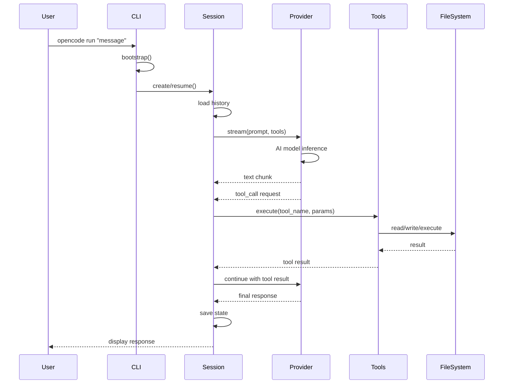

# Interactive Chat Session Flow

## Overview

**Flow ID**: `run-command-flow`
**Type**: Sequence
**Entry Point**: `packages/opencode/src/cli/cmd/run.ts:31` (function: `RunCommand`)

This flow represents the main interactive chat session with the AI. It's the primary user interface for OpenCode, allowing users to have conversational interactions with the AI assistant.

## Flow Diagram



## Flow Steps

### Step 1: Parse Command Arguments

**File**: `packages/opencode/src/cli/cmd/run.ts`
**Function**: `RunCommand.handler`
**Action**: Parse command arguments (message, model, continue, session)

Parses CLI arguments including:
- User message
- AI model selection
- Session continuation flag
- Specific session ID

**Calls**: `bootstrap`, `Config`, `Provider`

### Step 2: Initialize Project Context

**File**: `packages/opencode/src/cli/bootstrap.ts`
**Function**: `bootstrap`
**Action**: Initialize project context and configuration

Initializes the OpenCode environment:
- Loads project configuration
- Sets up file system watchers
- Initializes tool registry
- Configures AI provider

**Calls**: `Project.init`, `Config.load`

### Step 3: Create or Resume Session

**File**: `packages/opencode/src/session/index.ts`
**Function**: `Session.create`
**Action**: Create or resume session with message history

Manages session state:
- Creates new session or resumes existing
- Loads conversation history
- Initializes session prompt
- Configures available tools

**Calls**: `SessionPrompt`, `Provider.stream`

### Step 4: Stream AI Responses

**File**: `packages/opencode/src/provider/provider.ts`
**Function**: `Provider.stream`
**Action**: Stream AI responses from configured provider

Handles AI communication:
- Sends prompt to AI provider
- Streams response chunks
- Detects tool call requests
- Manages token usage

**Calls**: `ai.streamText`, `Tool.execute`

### Step 5: Execute Requested Tools

**File**: `packages/opencode/src/tool/registry.ts`
**Function**: `Tool.execute`
**Action**: Execute requested tools (bash, edit, read, write, etc.)

Executes tools requested by AI:
- Validates tool parameters
- Routes to specific tool implementation
- Handles tool errors
- Returns results to AI

**Calls**: `BashTool`, `EditTool`, `ReadTool`, `WriteTool`

### Step 6: Persist Session State

**File**: `packages/opencode/src/session/index.ts`
**Function**: `Session.save`
**Action**: Persist session state and message history

Saves session data:
- Writes conversation history
- Stores session metadata
- Updates session index
- Persists tool usage logs

**Calls**: `Storage.write`

## Usage Examples

### Basic Usage

```bash
# Start new chat session
opencode run "help me build a REST API"

# Continue previous session
opencode run --continue "add authentication"

# Use specific model
opencode run --model claude-3-opus "refactor this code"

# Resume specific session
opencode run --session abc123 "continue working"
```

## Key Components Involved

- **CLI Command Handler** - `packages/opencode/src/cli/cmd/run.ts`
- **Bootstrap** - `packages/opencode/src/cli/bootstrap.ts`
- **Session Manager** - `packages/opencode/src/session/index.ts`
- **Provider** - `packages/opencode/src/provider/provider.ts`
- **Tool Registry** - `packages/opencode/src/tool/registry.ts`
- **Individual Tools** - `packages/opencode/src/tool/bash.ts`, `edit.ts`, `read.ts`, `write.ts`, etc.

## Error Handling

The flow includes error handling at each step:
- Invalid arguments → User-friendly error messages
- Configuration errors → Bootstrap failure with diagnostics
- Session errors → Graceful session cleanup
- Provider errors → Fallback and retry logic
- Tool errors → Error messages returned to AI for recovery

## Performance Considerations

- Streaming responses provide immediate feedback
- Tool execution is non-blocking where possible
- Session state is cached in memory during active use
- File operations are optimized with lazy loading
