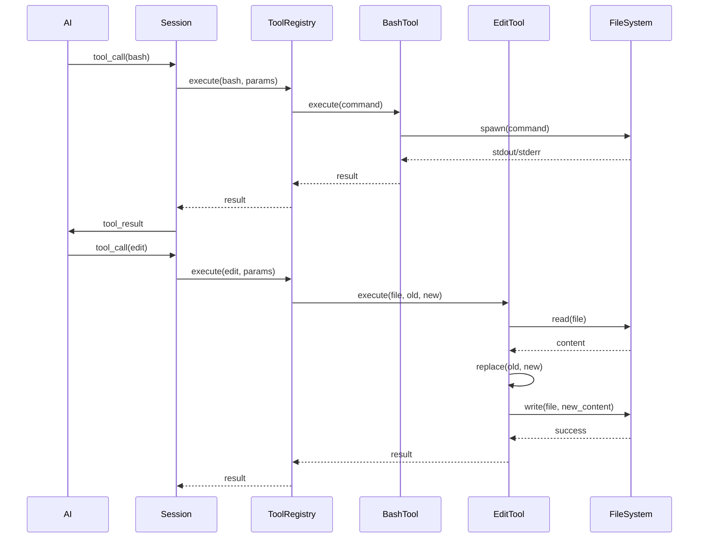

# Tool Execution Flow

## Overview

**Flow ID**: `tool-execution-flow`
**Type**: Sequence
**Entry Point**: `packages/opencode/src/tool/registry.ts:1` (function: `Tool.execute`)

This flow describes how tools are executed when requested by the AI. Tools are the primary mechanism for the AI to interact with the file system, execute commands, and perform operations.

## Flow Diagram



## Flow Steps

### Step 1: Receive Tool Call from AI

**File**: `packages/opencode/src/session/index.ts`
**Function**: `Session.handleToolCall`
**Action**: Receive tool call from AI

Processes incoming tool requests:
- Parses tool call from AI response
- Validates tool name
- Extracts parameters
- Routes to tool registry

**Calls**: `Tool.execute`

### Step 2: Route to Tool Implementation

**File**: `packages/opencode/src/tool/registry.ts`
**Function**: `Tool.execute`
**Action**: Route to specific tool implementation

Routes tool execution:
- Looks up tool by name
- Validates parameters against schema
- Invokes tool handler
- Handles errors

**Calls**: `BashTool`, `EditTool`, `ReadTool`, `WriteTool`, `GrepTool`

### Step 3: Execute Shell Command (BashTool)

**File**: `packages/opencode/src/tool/bash.ts`
**Function**: `BashTool.execute`
**Action**: Execute shell command

Runs shell commands:
- Validates command safety
- Spawns process
- Captures stdout/stderr
- Handles timeouts
- Returns exit code

**Calls**: `Bun.spawn`

### Step 4: Edit File (EditTool)

**File**: `packages/opencode/src/tool/edit.ts`
**Function**: `EditTool.execute`
**Action**: Edit file with exact string replacement

Performs file editing:
- Reads file content
- Locates exact string match
- Performs replacement
- Writes back to file
- Validates success

**Calls**: `File.read`, `SimpleReplacer`, `File.write`

### Step 5: Read File (ReadTool)

**File**: `packages/opencode/src/tool/read.ts`
**Function**: `ReadTool.execute`
**Action**: Read file content

Reads file content:
- Resolves file path
- Reads file with optional offset/limit
- Formats with line numbers
- Handles binary files
- Returns content

**Calls**: `File.read`

## Available Tools

### File Operations

#### ReadTool
**File**: `packages/opencode/src/tool/read.ts:16`

Read file contents with optional line range.

```typescript
{
  tool: 'read',
  params: {
    file_path: '/path/to/file.ts',
    offset: 0,      // optional: start line
    limit: 100      // optional: number of lines
  }
}
```

#### WriteTool
**File**: `packages/opencode/src/tool/write.ts:14`

Write content to file.

```typescript
{
  tool: 'write',
  params: {
    file_path: '/path/to/file.ts',
    content: 'file content...'
  }
}
```

#### EditTool
**File**: `packages/opencode/src/tool/edit.ts:20`

Edit file with exact string replacement.

```typescript
{
  tool: 'edit',
  params: {
    file_path: '/path/to/file.ts',
    old_string: 'old code',
    new_string: 'new code'
  }
}
```

### Search Tools

#### GrepTool
**File**: `packages/opencode/src/tool/grep.ts:8`

Search for patterns using ripgrep.

```typescript
{
  tool: 'grep',
  params: {
    pattern: 'function.*export',
    path: './src',           // optional
    type: 'ts'               // optional: file type
  }
}
```

#### GlobTool
**File**: `packages/opencode/src/tool/glob.ts:8`

Find files matching glob pattern.

```typescript
{
  tool: 'glob',
  params: {
    pattern: '**/*.ts',
    path: './src'            // optional
  }
}
```

### Execution Tools

#### BashTool
**File**: `packages/opencode/src/tool/bash.ts:46`

Execute shell commands.

```typescript
{
  tool: 'bash',
  params: {
    command: 'npm test',
    timeout: 30000           // optional: milliseconds
  }
}
```

### Code Intelligence Tools

#### LspDiagnosticTool
**File**: `packages/opencode/src/tool/lsp-diagnostics.ts:8`

Get language server diagnostics.

```typescript
{
  tool: 'lsp_diagnostics',
  params: {
    uri: 'file:///path/to/file.ts'  // optional
  }
}
```

### Task Management Tools

#### TodoWriteTool
**File**: `packages/opencode/src/tool/todo.ts:6`

Write todo list for task tracking.

```typescript
{
  tool: 'todowrite',
  params: {
    todos: [
      {
        content: 'Implement feature',
        status: 'pending',
        activeForm: 'Implementing feature'
      }
    ]
  }
}
```

## Tool Registry

### Registration

Tools are registered at startup:

```typescript
import { ToolRegistry } from './registry';

// Register tool
ToolRegistry.register({
  name: 'custom_tool',
  description: 'Perform custom operation',
  schema: {
    type: 'object',
    properties: {
      param: { type: 'string' }
    },
    required: ['param']
  },
  handler: async (params) => {
    // Tool implementation
    return { success: true };
  }
});
```

### Dynamic Tools

Tools can be registered dynamically:

```typescript
// Register MCP tools
await session.registerMCPTools(mcpClient);

// Register plugin tools
await session.registerPluginTools(plugin);
```

## Usage Examples

### AI Using Multiple Tools

```
AI: Let me read the current implementation first.
Tool Call: read { file_path: "src/api.ts" }
Tool Result: [file contents]

AI: I see the issue. Let me fix the bug.
Tool Call: edit {
  file_path: "src/api.ts",
  old_string: "if (user == null)",
  new_string: "if (user === null)"
}
Tool Result: { success: true }

AI: Now let's run the tests.
Tool Call: bash { command: "npm test" }
Tool Result: { stdout: "All tests passed", exitCode: 0 }
```

### Tool Chaining

The AI can chain multiple tools to accomplish complex tasks:

1. **Search** for files → `grep` or `glob`
2. **Read** files → `read`
3. **Analyze** content
4. **Edit** files → `edit` or `write`
5. **Verify** changes → `bash` (run tests)

## Key Components Involved

- **Tool Registry** - `packages/opencode/src/tool/registry.ts`
- **Bash Tool** - `packages/opencode/src/tool/bash.ts`
- **Edit Tool** - `packages/opencode/src/tool/edit.ts`
- **Read Tool** - `packages/opencode/src/tool/read.ts`
- **Write Tool** - `packages/opencode/src/tool/write.ts`
- **Grep Tool** - `packages/opencode/src/tool/grep.ts`
- **Glob Tool** - `packages/opencode/src/tool/glob.ts`
- **LSP Diagnostic Tool** - `packages/opencode/src/tool/lsp-diagnostics.ts`
- **Todo Tool** - `packages/opencode/src/tool/todo.ts`
- **Session** - `packages/opencode/src/session/index.ts`

## Error Handling

Tools implement comprehensive error handling:

```typescript
try {
  const result = await Tool.execute('bash', {
    command: 'invalid-command'
  });
} catch (error) {
  // Error is returned to AI for recovery
  return {
    isError: true,
    message: 'Command not found: invalid-command',
    exitCode: 127
  };
}
```

### Error Types

- **ValidationError** - Invalid parameters
- **FileNotFoundError** - File doesn't exist
- **PermissionError** - Insufficient permissions
- **TimeoutError** - Operation timed out
- **ExecutionError** - Tool execution failed

## Security Considerations

### Sandboxing

Tools execute in a controlled environment:
- Working directory restrictions
- Environment variable filtering
- Resource limits (CPU, memory)
- Network access control
- File system access boundaries

### Command Validation

The BashTool includes safety checks:
- Dangerous command detection
- Path traversal prevention
- Command injection prevention
- Whitelist of allowed commands (optional)

### File Operations

File tools implement safety:
- Path validation (no parent directory access)
- File size limits
- Binary file detection
- Symlink resolution
- Write permissions check

## Performance Considerations

### Optimization Strategies

1. **Parallel Execution** - Independent tools run concurrently
2. **Caching** - File content cached during session
3. **Lazy Loading** - Tools loaded on demand
4. **Streaming** - Large outputs streamed incrementally
5. **Timeout Management** - Long-running operations timeout gracefully

### Resource Limits

- **Bash timeout**: 120 seconds (configurable)
- **File size limit**: 10MB per read
- **Memory limit**: 1GB per tool execution
- **Concurrent tools**: 10 maximum

## Advanced Features

### Tool Composition

Tools can be composed for complex operations:

```typescript
// Custom tool that combines multiple operations
ToolRegistry.register({
  name: 'refactor',
  handler: async (params) => {
    // 1. Search for pattern
    const files = await Tool.execute('grep', { pattern: params.pattern });

    // 2. Edit each file
    for (const file of files) {
      await Tool.execute('edit', {
        file_path: file,
        old_string: params.old,
        new_string: params.new
      });
    }

    // 3. Run tests
    const testResult = await Tool.execute('bash', { command: 'npm test' });

    return { success: testResult.exitCode === 0 };
  }
});
```

### Tool Hooks

Tools support lifecycle hooks:

```typescript
ToolRegistry.register({
  name: 'custom_tool',
  before: async (params) => {
    // Pre-execution logic
    console.log('Executing tool:', params);
  },
  handler: async (params) => {
    // Main logic
  },
  after: async (result) => {
    // Post-execution logic
    console.log('Tool result:', result);
  }
});
```
